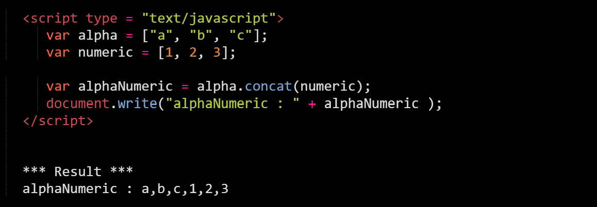
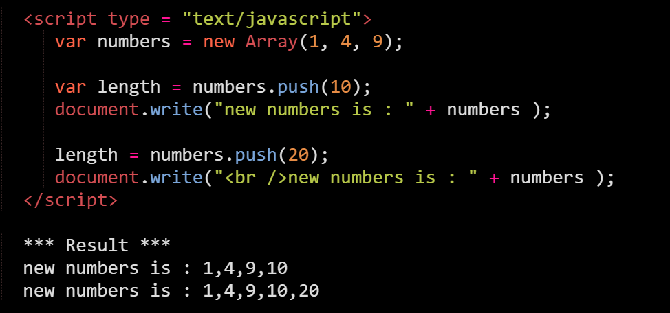
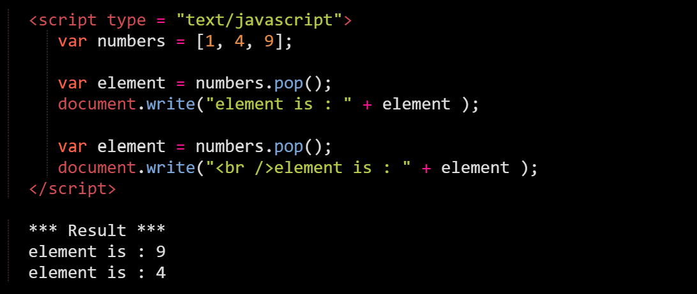
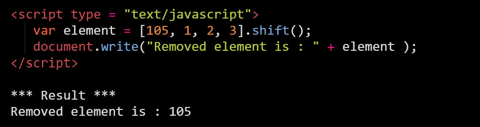
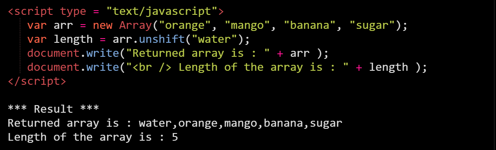
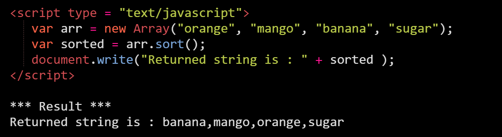
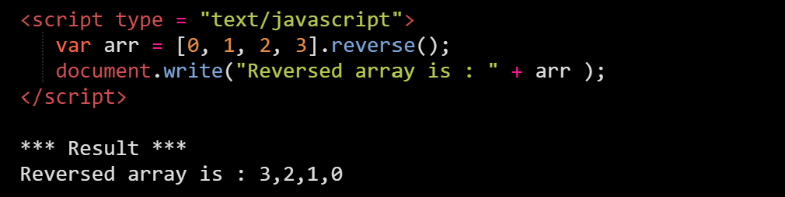

To make things easier, arrays provide a lot of methods. Let's go over some of the basic ones which would give you an idea of they look like.

# Concat() 
Joins two or more arrays and returns a new array.

# Push() 
Adds one or more elements to the end of an array and returns the resulting length of the array.

# Pop() 
Removes the last element from an array and returns that element.

s
# Shift() 
Removes the first element from an array and returns that element.

# Unshift() 
Adds one or more elements to the front of an array and returns the new length of the array.

# Sort() 
Sorts the elements of an array in place, and returns a reference to the array.

# Reverse() 
Transposes the elements of an array, in place: the first array element becomes the last and the last becomes the first. It returns a reference to the array.

