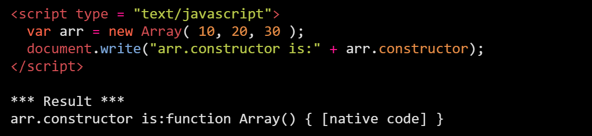
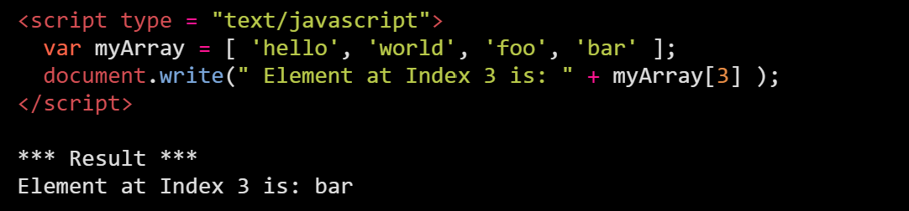
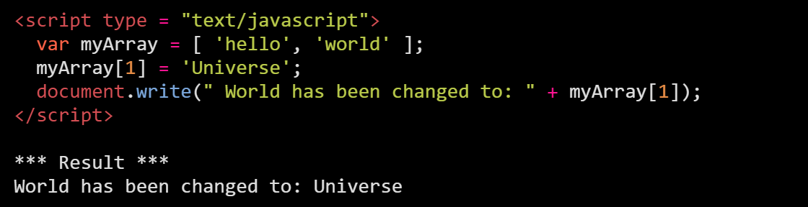
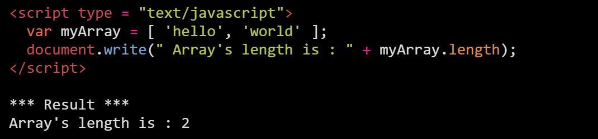

Here is a list of the properties of the Array object along with their description.

# Constructor() 
Returns a reference to the array function that created the object.

# Index() 
The property represents the zero-based index of the match in the string. Index provides a way to access or modify elements based on their position in the array.

- Access an array element by index:

- Modify an array element by index:

# Length() 
Reflects the number of elements in an array.

