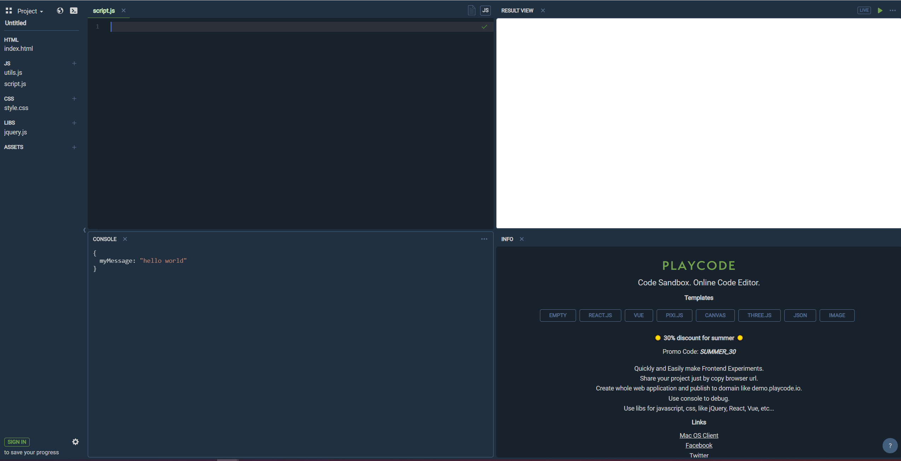

## Table of Contents

Table of Contents

{}

## JavaScript Basics
 Hi there! If you're reading this, it hopefully means that you're here to learn JavaScript 😁🥳. Whether this is your first time coding or you want a way to quickly pick up a new language - you're in the right place! Get ready to discover the power of programming and have fun. 

## What is Code?

We can't learn how to code without first understanding what exactly code is. Think of your favorite website, if you can't think of one let's take NuevoFoundation.org. As a user, all you have to do is type the web address in your browser and before you know it - ta da! - the website appears, with all of its pretty colors and pictures of nuvi. 

Easy right? Not exactly, behind what seems like a simple interaction there exists hundreds - if not thousands! - lines of code to make it all work. Let's take just one step of this interaction, searching and going to the Nuevo Foundation website. There are billions of websites (1.7 billion last time I checked), how does your browser get to the website you want so quickly? Think about that for a second...

There are people who coded that, and people that coded your browser, and the Nuvi website, and this curriculum you're reading, and ... well you get the point. Code is how we humans design and build things like websites, apps, and games. It's the language we use to tell computers what to do. 

## What is JavaScript and what is it used for?

Just like there exists a bunch of human languages, there exists a bunch of programming languages. Perhaps you've heard of some of them, such as Python or Java. Each programming language has its strengths and purposes - for example, CSS is used for styling websites, Python is really good for data science, and so on.

JavaScript is sometimes referred to as the "language of the web." Pretty much any website you can think of uses JavaScript in some way of form. JavaScript is really good at controlling website behavior, for example, controlling what happens when you click a button or transferring data between pages. 

The good thing is that once you learn one language, you can learn another one pretty quick as the fundamentals tend to stay the same. 

## Environment Set Up

Environment? I thought this was a coding workshop? 

Environment is just what programmers like to call their setup for coding. You know how you use things like Microsoft Word or Google Docs to write essays? You can think of that as your "writing essay" environment. 

For programmers, there exists applications called IDEs, which stand for Integrated Development Environment. These are the types of applications that let us write and run code.

For this workshop, we will be using playcode.io.

Once you open playcode.io, there are a few things you need to do before we get started:
* close all files in the top left except for __script.js__.
* Delete everything in the __script.js__ file.
* Turn off __live__ by clicking once on the __live__ button in the top right.

If you've done all the above steps correctly, your screen should look like this:

Now we are _finally_ ready to go and learn some JavaScript!