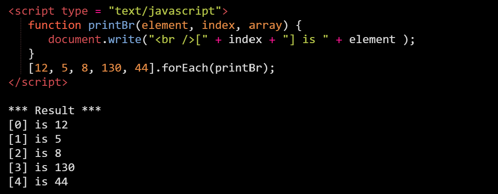

One of the common array operations is to iterate over the values and process each one of them in some way. Let's go over and discuss some of the simplest ways to achieve this:


# Array.forEach()
The `forEach()` method calls a function (a callback function. In this case, function named printBr) once for each array element.

The function passed to `forEach` is executed once for every item in the array, with the array item passed as the argument to the function. Unassigned values are not iterated in a forEach loop.

<b>Syntax:</b>
```javascript
arrayName.forEach(functionName);
```

<b>Example:</b>

