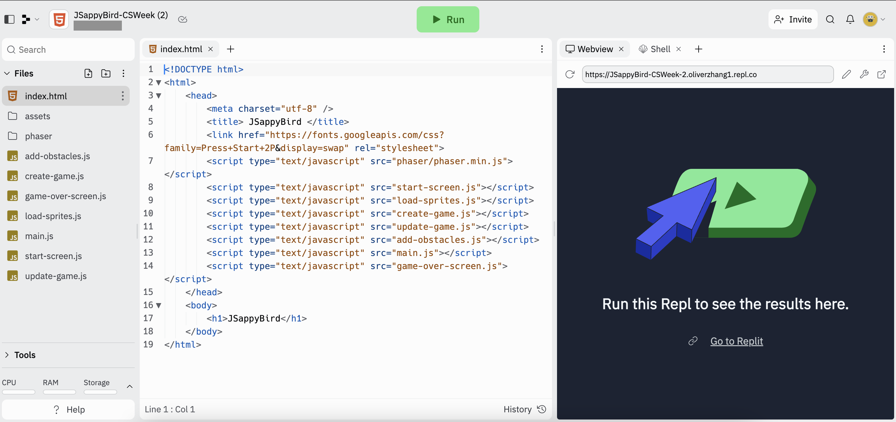

## Introduction

You may be familiar with the Flappy Bird game. This workshop will guide you through making your own version of the game using the JavaScript language! Are you up for the challenge?

<iframe src="https://giphy.com/embed/euuaA2cwLEUuI" width="350" height="350" frameBorder="0" class="giphy-embed"></iframe>

As you are probably familiar with the Flappy Bird game, this workshop will guide you through how you can make your own version of the game and let your friends try it out! In this tutorial, we will learn how to use the JavaScript language to help the bird play in the world you will create.

## Starting Up

The goal of today's activity is to learn JavaScript skills and incorporate your new-found knowledge to create a Flappy Bird game! Let's get the game set up.

Today you will be using Replit. Before starting, you will need to sign up for a Replit account, if you do not yet have one. 

Click the button below to sign up for a Replit account - you will need an email account in order to sign up. If you already have a Replit account, you can login to your account using the below button as well.

<a class="my-2 mx-4 btn btn-info" href="https://replit.com/signup" target="_blank">Sign up for Replit</a>

Next, launch the Replit console we will use today by clicking the below button. You should see the screen below.

<a class="my-2 mx-4 btn btn-info" href="https://replit.com/@nuevofoundation/JSappyBird-CSWeek" target="_blank">Launch Replit</a>

We will now fork the Repl, which simply means to make a copy of the program, so that we can make our own changes to it. Click on the "Fork Repl" button on the top right, and then the "Fork Repl" button.

After forking the Replit, you will see a window similar to the one below:

We will ignore some of the details on this screen, but we will go over some of the basics that show up. The `index.html` file, as well as all the files ending with `.js` contain code, or instructions for the computer to run. By pressing the **run** button, you tell the computer to perform the instructions in the code. Any results from running the code will be displayed on the right side, called the **console**.

If you press **run** now, you will see that nothing happens! Your job is to help Nuvi complete the code for this game!

Any activities under the **Activity** sections will be done in this browser tab. You will do these activities on your own, but help is available when you are stuck.

## Table of Contents

Table of Contents

{}

