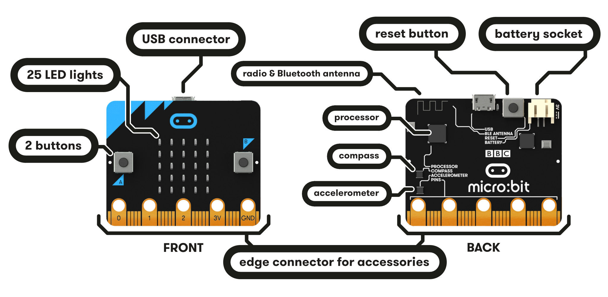
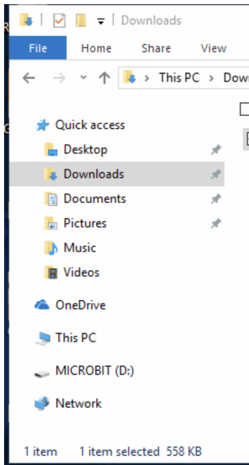
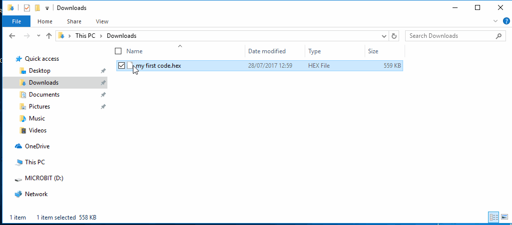

### An introduction to JavaScript and hardware using [MicroBits](https://microbit.org/guide/)


## The Basics

## What is JavaScript?

JavaScript is one of many programming languages and it is known as the programming language for the web. It used to control website behavior, such as button clicks, pop-up windows, data flows, and many other functions.

## Variables

Variables are containers in your code that can hold a single number, word, or other information. This information can be used and changed by calling the variable later on throughout your program. This means that you are asking your program to access the information that you've stored.

With a few exceptions, variables can be named anything containing letters, digits, underscores, and dollar signs. BUT No matter what, they cannot have spaces and they should always start with a letter.

Variables can hold different types of data, let's go over the basic ones.

## The Data Types

### Integers

Integer is basically just a fancy name for any real number that is not a decimal. For example, integers are whole numbers like 3, 100, 6,000, -3, and so on!

```javascript
// this is a comment, these are used to describe what your code does
// Below are different examples of variables

//Integer (non decimal number) variables examples:

var a = 5;
var b = 10;
var c = 15;
```

### Doubles

Doubles are your other "messy" numbers, the ones with that funky decimal. Examples are numbers like 0.5, 1.5, and so on.

```javascript
//Double (decimal number) variable examples:

var x = 0.5;
var y = 1.5;
var z = 2.0;
```

### Strings

Strings are just what programmers decided to call words. If it helps remind you that strings are words, think of them as a "string" of characters. Strings can be anything like your name or the name of favorite pet.

Strings are surrounded by "quotation marks"

```javascript
//String (one or more words aka a "string" of characters) variable examples:
//string variable values are surrounded by "quotation marks"

var company = "MICROSOFT";
var course = "Coding with Micro:Bits!";
var message = "Coding is so fun!";
```

### Characters

Characters are single letters. They are surrounded by 'single quotes'

```javascript
//Character (a single letter) variable example:
//character variable values are surrounded by 'single quotes'

var letter = "A";
```

### Booleans

Sometimes programmers want to check if certain conditions are true or false. This information is stored in a Boolean data type.

If you're curious about why these are called Booleans, a guy named George Boole is the one that created them.

```javascript
//Boolean (true or false) variable example

var canPigsFly = false;
var codingIsCool = true;
```

## Math Operations

Ah yes our favorite, computers are essentially calculators so it should be a given that we can do math on them. Here are examples of the math you can have in your JavaScript programs.

### Addition

```javascript
var a = a + b;                //a = 15
var a += b;                   //a = 25
```

### Subtraction

```javascript
var a = a - b;                //a = 15
var a -= b;                   //a = 5
```

### Multiplication

```javascript
var a = a * b;                //a = 50
var a *= b;                   //a = 500
```

### Division

```javascript
var a = a / b;                //a = 50
var a /= b;                   //a = 5
```

### Modulo

Ah yes, the one that sounds scary but actually isn't. Modulus operations just gives you the remainder after division. For example, 10 % 2 = 0 because when you divide 10 by 2, you have no remainder left.

```javascript
var d = 10 % 2; //d= 0
var e = 5 % 2; //e= 1
```

### Print Statements

Sometimes you want your computer to actually display some text or the data your variables hold. To do this we use print statements.

```javascript
console.log("This will show up in the console, but not the webpage");
alert("This will display as a pop up window");

var userResponse = prompt("Do you want to play a game?");
```

### Conditionals and Logical Operators

Conditionals, most commonly called if-statements, are used to choose what code you want to run depending on the value of your variables or other conditions.

```javascript
//conditionals
if (true) {
  //this section of code will run
}
if (false) {
  //this section of code will not run
}

var age = 10;
if (age < 18) {
  // if age is less than 10
  print("You're not an adult yet! :( ");
}
```

### Loops

And last but not least, we have things called loops. These allow you to repeat parts of your code until a certain condition is met.

The alert() function you see in the code snippet below simply displays a pop-up displaying the parameter you pass to it, the parameter is what is inside the parantheses, in this case it is displaying the updated count value.

```javascript
//while loop - counts down from 10
var count = 10;

while (count > 0) {
  alert(count);
  count--;
}

//for loop - counts down from 10
for (var i = 10; i > 0; i--) {
  alert(i);
}

//endless while loop
while (true) {
  //this will happen over and over again forever since the condition will never be false. true is always true.
}

//break;	//stops a loop immediately and moves to line below the loop
```

## Getting started with Micro:Bits

Now that you know the basics of JavaScript, you can use your knew skills to start programming your Micro:Bits!

### What is a Micro:Bit?

A Micro:Bit is a programmable mini computer! It can be coded from any web browser in various languages like javaScript, Python,Scratch, and Blocks. For our session today with we will be using JavaScript.

Your Micro:Bit has the following physical features:

- 25 individually-programmable LEDs
- 2 programmable buttons
- Physical connection pins
- Motion sensors (accelerometer and compass)
- Wireless communication via bluetooth and radio
- USB interface

<p style="text-align: center; "></p>

If you want to learn more about each individual component and all the features that come with your Micro:Bit, you can click [here](https://microbit.org/guide/features/).

Go ahead and take out the the Micro:Bit and the rest of the components from the bag. You should have one Micro:Bit, 2 batteries, a micro USB cable, and the battery holder (the black box with the red and black wires coming out of it). If you're missing anything or need help feel free to ask one of the instructors!

### Quick Start

Go ahead and plug in your Micro:Bit to your computer using the USB cable. You won't be needed the batteries right for a while so you can go ahead and put those aside.

Once you plug in the Micro:Bit to your computer, it will show up on your computer as a drive called 'MICROBIT'. If you open file explorer you should see something similar to the picture below.

<p style="text-align: center; "></p>

I've coded up a game to give you an example of what you can make! Go ahead and download my game by clicking the link below.

<a href = "resources/files/microbit-Asteroids.hex" download>Click to Download</a>

Once it downloads you should see the HEX file inside your 'Downloads' folder. (You'll also notice I named this game 'Asteroids', if you have a better name please let me know)

To actually play the game, you'll need to copy this file to your Micro:Bit. To do this you can simply copy and paste the file to the Micro:Bit directory, but I find another method much easier. Simply right click the file, click **Send To** then select **MICROBIT**



If you did this correctly, you will notice your Micro:Bit LEDs will pause for a bit and the yellow LED on the back will blink while the Micro:Bit downloads the code. If you don't see this, don't worry and ask us for help.

Curious about what my game's code looks like? Click [here](https://makecode.microbit.org/_bhJYfUURARgx)

### Protecting Your Spaceship


Ready to play? These are the list of controls:

- **A + B:** Shoot lasers to destroy incoming asteroids
- **Tilt:** Tilt your microbit left or right to move your spaceship

Simple right? We'll see. I've programmed this game to go faster the more asteroids you destroy. Think you have the high score? Show off and let us know! You can see your score by waiting for the game over screen to pass.

**TIP:** If you reach the game over screen and want to start a new game, simply click the reset button behind your Micro:Bit.

### Get Coding

Finally! Time for the best part! Now you can use everything you've learned to create your own programs and code your Micro:Bits!

First, let's display our name on the Micro:Bit. Follow along with me.

Now let's go through two tutorials together! Go to this [link](https://makecode.microbit.org/) and find the "Flashing Heart" tutorial.

We'll be going through this and the "Micro Chat" tutorials.

### Your Turn

Go ahead and find another tutorial you're interested in, or if you're feeling confident, code your own program from scratch! Have fun!

### Resources and Advanced Micro:Bit Cheat Sheet

#### Variables, Printing, and Downloading

- JavaScript variables are the same except the word 'let' is used instead of var

  ```javascript
  let variable = "text";
  ```

- The command `basic.showString(variable);` will make the text appear in the LED of the Micro:Bit

  ```javascript
  let name = "Gonzo";
  basic.showString(name);
  ```

### Useful JavaScript Commands

The commands below are in javaScript, if you prefer to use the Block code equivalent just look in the corresponding library. For example, you can find basic.forever() by clicking the Basic tab and dragging the forever function to your screen.

```javascript
basic.forever(function() {
  // Code between these brackets will run forever on your Micro:Bit
});

// Displays the number inside the parantheses on your Micro:Bit
basic.showNumber(number);

// Displays the string (word) inside the parantheses on your Micro:Bit
basic.showString(string);

// Generates a random number between 0 and the number inside the parantheses
Math.random(number);

input.onButtonPressed(Button.A, function() {
  // Code here runs when button you specify is pressed, in this case when Button A is pressed
});

// Displays the specified character on the LED screen
basic.showIcon(IconNames.Character);

// Pauses your Miceo:Bit for the specified amount of microseconds
basic.pause(microseconds);

//
```
