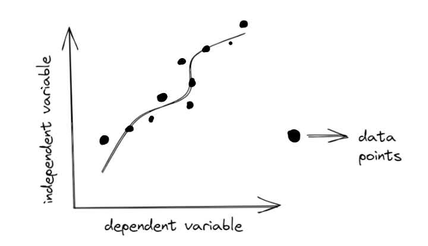

# What is regression?
Regression is a technique to model the relationship between a feature (independent variables) and a variable feature (dependent variables). It helps us understand how the value of a dependent variable is changing based on the value of the independent variable. When applied properly it helps us predict values 😯!

||
|:--:|
|Regression|

Regression gives a line or a curve by plotting dependent and independent variables. When we apply regression, we need to come up with a mathematical model that can explain the behavior we are seeing. If the mathematical model we use doesn't represent the data accordingly we need to find another model to use.

## Example 1: Predicting the Weather Temperature
For example, say you need to predict the temperature of a place. What do you need?

- Altitude
- Location
- Month
- Year
- Humidity
- Atmospheric Pressure

The **temperature** is the dependent variable while the other properties we have mentioned above are the independent variables.

## Fitting Your Model
To fit a model is to make sure that the model you are using represents the information you have.

### Excercise 1
Suppose that someone wants to know the type of shapes they have based on the area of the shape. 

1. Is that even possible? Can someone know what shape they have based on the area?
{}  
***No, as you can quickly guess no relation exists between the **area** and the type of shape.***
{}
 
2. If the area is no good. What property from shapes can we use to know the shape?
{}  
***The number of **sides** it has! As the number of sides increases, you can know the type of shape.***
|Number of Lines|Shape|
|:--:|:--:|
|1|-|
|2|-|
|3|Triangle|
|4|Square|
|5|Pentagon|
|6|Hexagon|
|7|Heptagon|
|8|Octagon|
|9|Nonagon|
|10|Decagon|
{}
 

You always need to make sure that the model you choose to represent your data fits what you are working on. Otherwise, you might have one of two issues:
- **Underfitting**
    
    This happens when you are unable to find a relationship in the data you have been given. This often happens when there is not much data to use.

- **Overfitting**
    
    When you are trying to accommodate every possible value in your data, even the ones that don't represent anything. By doing this you might be choosing values that are **outliers** and do not represent the reality of things. For example, having a shape that has 1 or 2 lines doesn't make sense.
