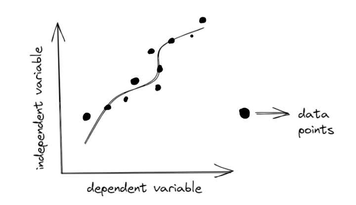

# What is regression?
Regression is a technique to model the relationship between a feature (independent variables) and a variable feature (dependent variables). This helps us know how the value of a dependent variable is changing based on the value of the independent variable. It helps us predict values 😯!

Regression gives a line or a curve by plotting dependent and independent variables. The line or curve fites the data points based on the prediction we made.

||
|:--:|
|Regression|

When we apply regression, we need to come up with a matematical model that is able to fit the regression.

## Example 1: Predicting the Weather Temperature
For example, say you need to predict the temperature of a place. What do you need?

- Altitude
- Location
- Month
- Year
- Humidity
- Atmospheric Pressure

The **temperature** is the dependent variable while the other properties we have mentioned above are the independent variables.

## Fitting Your Model
Suppose you have a bunch of shapes that you want to classify based on the number of sides it has. How would you come up with a solution for that?

{}  
As the number of sides increases, you can determine the type of shape.

// TODO: Add image to show the relation of # of sides and shapes.

{}

Now suppose that you want to know the type of shapes based on the area of the shape. Is that possible?

{}  
No, as you can quickly guess no relation will let us know the type of shape based on the area.
{}

You always need to make sure that your models fits what you are working on, otherwise you might have one of two issues:

**Underfitting** &rarr; when you are unable to find a relationship in the data you have been given. This often happens when there is not much data to use.

**Overfitting** &rarr; when you are trying to accomodate every value in your data. By doing this you might be choosing values that are **outliers** and do not represent the reality of things.

# Simple Linear Regression
Consider an example where there is only one independent variable and we need to predict a value, the dependent variable. If we wanted to represent this mathematically it would be done as a linear function. As you may have expected by the name, the function is just a straight line:

<h1>
\[
    y = f(x) = ax + b
\]
</h1>

- X is the independent variable.
- A is the "weight" of the dependent variable.
- B is the intercept. This is obtained when the value of the independent variable is 0.

# Let's write some code!

Navigate here to access the Replit panel and play with the documents: [Nuevo Foundation - Simple Linear Regression](https://linearregression.nuevofoundation.repl.co/)

[image 1]()

