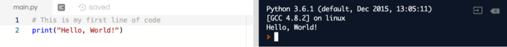
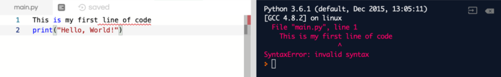

<iframe width="100%" height="500px" src="https://www.youtube.com/embed/NE9IEUi1Eqk" frameborder="0" allow="accelerometer; autoplay; encrypted-media; gyroscope; picture-in-picture" allowfullscreen></iframe>

### Make notes while you are coding

**Comments** are the parts of the code that do not get evaluated. In Python, they are preceded by the `#` symbol. Anything after the `#` symbol is part of the comment and is ignored by your code. Comments are put in the code to tell the readers what the code is doing. They can make maintenance of code easy and can also help in finding bugs. 

While writing code, If at any time you wish to write notes to help you understand the code, use the `#` symbol to create a comment. 

Be careful, if you remove the `#` symbol, your code will not work! 

 

Try adding a comment above your first line of code and press run. You will see that the computer will ignore your comment.

<iframe height="600px" width="100%" src="https://repl.it/@nuevofoundation/Basics-Comments?lite=true" scrolling="no" frameborder="no" allowtransparency="true" allowfullscreen="true" sandbox="allow-forms allow-pointer-lock allow-popups allow-same-origin allow-scripts allow-modals"></iframe>