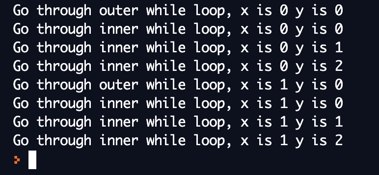

### Nested loops
To learn *nested loops*, you need to know simple for-loops and while loops. If you have already learnt them, you can skip to the next part. Otherwise, jump to a specific Python section to learn more about these topics:

- <a href="../../../python-basics/loops" target="blank">For-loop and While-loop</a>
<br/><br/>
In this section, we will use one loop inside another, which is called *nested loop*.
<br/><br/>
#### Nested while loop
```python
#This is the format for nested while loop
while expressionA:
    while expressionB:
        statement(B)
    statement(A)
```
In the `while` loop above, when expressionA is `False`, we will skip the whole block. When expressionA is `True`, we will check expressionB. If expressionB is `True`, statement(B) will be executed. If expressionB is `False`, we will skip and return to statement(A).
<br/><br/>
In conclusion, if expressionA is `False`, none of the statements will be executed; statement(A) and statement(B) will both be executed if and only if both expressionA and expressionB are `True`.

Let us take a look at one example for nested while loop.
 ```python
 #This is the example for nested while loop.
 x = 0
 y = 0
 while x < 3:
    print("Go through outer while loop, x is", x, "y is", y, sep = " ")

    while y < 5:
     print("Go through inner while loop, x is", x, "y is", y, sep = " ")
     x += 1
     y += 1
 ```
 This is the output of our example.
 
 <br/><br/>
#### Challenge
Try to change the integers in the nested while loop and predict the outputs. Then run the code and observe the outputs. Do they match your predictions?
<iframe height="600px" width="100%" src="https://repl.it/@nuevofoundation/Basic-Nest-loops?lite=true" scrolling="no" frameborder="no" allowtransparency="true" allowfullscreen="true" sandbox="allow-forms allow-pointer-lock allow-popups allow-same-origin allow-scripts allow-modals"></iframe>
<br/><br/>
#### Nested for loop

```python
#This is the format for nested for loop
for variableA in rangeA:
   for variableB in rangeB:
      statements(B)
   statements(A)
```
```python
#This is the example for nested for loop
#This creates the original picture.

```
