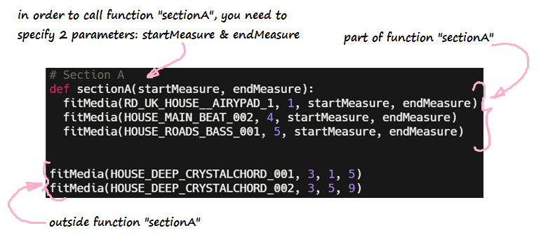

<iframe width="100%" height="600px" src="https://www.youtube.com/embed/0207zoiJ6s8" frameborder="0" allow="accelerometer; autoplay; encrypted-media; gyroscope; picture-in-picture" allowfullscreen></iframe>

**Functions** are a way to organize pieces of similar or repeating code. Rather than having to constantly type out the same code, we can put the desired code in a function and call it whenever we want to use it.

{}
**Note:** The purpose of a function is to help reduce redundant code
throughout the program.
{}

## Creating a function 

### Define your function - name & parameters
To make a function in python, we must use the `def`
keyword. This keyword tells the code editor where the function is
defined. `def` is followed by the name of the function. In order to
generalize the function (so that we can use it at multiple places), we
might need to send some information to it. This is achieved using
parameters. They are placed in between parentheses `()` and follows
right after the name of the function. If no parameters are needed, they
can be ignored. The function declaration ends with a colon. Here's what
a function looks like:

{}
Make sure that the first line of your function always ends
with a colon `:`
{}

### Write the function body
In Python, indentation defines which code is controlled
by the function. For example, look at the following image:

The code that is indented underneath the `sectionA` function is the code
that is executed each time function `sectionA` is called.

{}
**Warning:** Since identation is very important in Python, make sure
that the body of the function always starts with 2 spaces.
{}

## Using the function - Function call

To call a function, input the name of the function and its parameters
wherever you want to execute the function. For example, in order to call
function `sectionA`, we would do something like this:

{}
**Be careful:** When making a function in Python, you must define the
function and its contents before it is called. In other words, in the
code, you need to put the function declaration above the function call.
Otherwise, you will receive a NameError like below. See the following
figure for an example:

{}

## Challenge - Create your own function!

**Challenge:** Create a function called addNumbers that takes 2 parameters called number1 & number2 and prints the sum on console. Call the function addNumbers with parameters 3 & 5.
What is printed on the console?

<iframe height="600px" width="100%" src="https://repl.it/@nuevofoundation/Basics-Functions?lite=true" scrolling="no" frameborder="no" allowtransparency="true" allowfullscreen="true" sandbox="allow-forms allow-pointer-lock allow-popups allow-same-origin allow-scripts allow-modals"></iframe>
