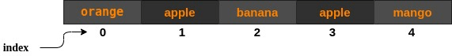

Lists are the ordered collection of items and can be written as comma separated values inside square bracket `[]`. You can access the element  of a list by using indexes inside square bracket. The index starts from `0` and goes up to the `(number of elements in the list - 1)` and the first element is at index `0`. So, a list having 6 elements will have indices from 0 to 5. 

```python
#Creating a list of 5 fruits
fruits = ['orange', 'apple', 'banana', 'apple', 'mango']

#Print element at index 2
print(fruits[2])     ##it prints banana


```



{}

Lists can have duplicate elements.

{}

```python
#lists can also have different datatypes
my_list = ['candy', 10, 2.5]

```

### Length of the list

You can get the length of the list by using `len(list)` function and the list name is passed as the parameter.

```python

length = len(fruits)  ##Now length = 5


```

### Append an element in the list

Appending an element can be done by the `list.append(x)` function where `x` is the element that you want to append. It adds the element at the end of the list.

```python

#Before the list is ['orange', 'apple', 'banana', 'apple', 'mango']
fruits.append('lemon')
#Now the list is ['orange', 'apple', 'banana', 'apple', 'mango', 'lemon']

```

### Insert an element at a specific index

You can insert an element at specific index by of a list by `list.insert(i, x)` function. Here `i` is the index where you want to insert and `x` is the element that you want insert.


```python

fruits.insert(1, 'guava')
#Now the list is ['orange', 'guava', 'apple', 'banana', 'apple', 'mango', 'lemon']

```

### Remove an element from the list

`list.remove(x)` function searches for the first instance of the given element `x` and removes it from the list.

```python

fruits.remove('apple')
#Now the list is ['orange', 'guava', 'banana', 'apple', 'mango', 'lemon']

```

{}

`list.remove(x)` throws a value error if the element `x` is not present in the list.

{}


### Remove an element at specific position

`list.pop(i)` function removes the element at the index `i`.

```python

fruits.pop(0)
#Now the list is ['guava', 'banana', 'apple', 'mango', 'lemon']

```

{}

If you don't specify the index,`list.pop()` then it removes the last element from the list.

{}


### Reverse the elements of the list

`list.reverse()` function reverse the elements of the list.

```python

fruits.reverse()
#Now the list is ['lemon', 'mango', 'apple', 'banana', 'guava']

```

### Get the minimum and maximum element of the list

`min(list)` function returns the minimum element of the list and the maximum element can be found by using the `max(list)` function.

```python

my_list = [4, 1, 2, 5, 3]  ## Defining a new list of Integers

print(min(my_list)) ## prints 1, the minimum element of my_list
print(max(my_list)) ## prints 5, the maximum element of my_list

```

### Try it yourself

<iframe height="600px" width="100%" 
 src="https://repl.it/@nuevofoundation/python-blank?lite=true" scrolling="no" frameborder="no" allowtransparency="true" allowfullscreen="true" sandbox="allow-forms allow-pointer-lock allow-popups allow-same-origin allow-scripts allow-modals"></iframe>

