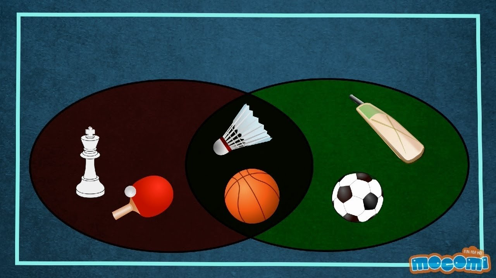

Just like a list, a set is a collection of items. The difference between a set and a list is that a set cannot contain duplicates. So, if you have 5 chocolates and you put them in a set, you'll only be left with 1 chocolate as duplicates will be removed. 😢



In the image above, the left side represents <b><font color="red">Indoor Games</font></b> (Chess & Table Tennis) while the right side represents the <b><font color="green">Outdoor Games</font></b> (Cricket & Football). The middle represents the common part of both these sets. These are the games that can be played Indoors as well as Outdoors (Basketball & Badminton). The middle part is also known as the intersection between two sets.

{}
A set is created by using the set() function or placing all the elements within a pair of curly braces.
{}

```python
indoorGames = set(["Chess", "Table Tennis", "Basketball", "Badminton"])
outdoorGames = {"Cricket", "Football", "Basketball", "Badminton"}
print('** Indoor Games **')
print(indoorGames)
print('** Outdoor Games **')
print(outdoorGames)
```
</br>

<b>Output</b>

    ** Indoor Games **
    set(["Chess", "Table Tennis", "Basketball", "Badminton"])
    ** Outdoor Games **
    set(["Cricket", "Football", "Basketball", "Badminton"])
</br>

### Union of Sets
If we have 2 sets as above, the union of these two sets contains the games from both the sets. The output will be a new set. The duplicates will be removed. </br>
The symbol used for Union is `|`.

```python
allGames = indoorGames | outdoorGames
print('** All Games **')
print(allGames)
```
</br>

<b>Output</b>

    ** All Games **
    set(["Chess", "Table Tennis", "Basketball", "Badminton", "Cricket", "Football"])
</br>

### Intersection of Sets
The intersection of 2 sets will be the set containing both indoor and outdoor games. </br>
The symbol used for Intersection is `&`.

```python
commonGames = indoorGames & outdoorGames
print('** Common Games **')
print(commonGames)
```
</br>

<b>Output</b>

    ** Common Games **
    set(["Basketball", "Badminton"])
</br>

### Difference of Sets
The difference of 2 sets will be the set that contains games from one set that are not present in the other set</br>
The symbol used for Difference is `-`.

```python
indoorOnlyGames = indoorGames - outdoorGames
print('** Indoor Only Games **')
print(indoorOnlyGames)
```
</br>

<b>Output</b>

    ** Indoor Only Games **
    set(["Chess", "Table Tennis"])
</br>

### Print the items of a set
You cannot print the items of a set using the item number like a list. The elements of a set are not in a fixed sequence. But you can go through the elements of a set using a `for` loop.

```python
for g in indoorGames:
	print(g)
```
</br>

<b>Output</b>

    Chess
    Table Tennis
    Basketball
    Badminton
</br>

### Adding items to a set
We can use the .add function to add a new game to a set. 
```python
indoorGames.add("Carrom")
print('** Indoor Games **')
print(indoorGames)
```
</br>

<b>Output</b>

    ** Indoor Games **
    set(["Chess", "Table Tennis", "Basketball", "Badminton", "Carrom"])
</br>

### Removing items to a set
We can use the .discard function to remove an item from the set. 
```python
indoorGames.discard("Chess")
print('** Indoor Games **')
print(indoorGames)
```
</br>

<b>Output</b>

    ** Indoor Games **
    set(["Table Tennis", "Basketball", "Badminton", "Carrom"])

{}
You cannot remove an item that is not in the set !
{}
