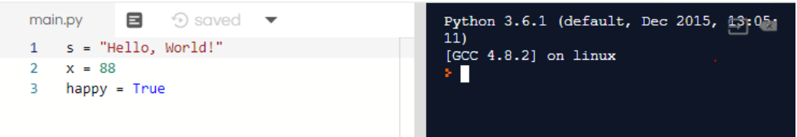

---
title: "Variables"
date: 2020-02-10T13:24:17-07:00
draft: false
weight: 4
--- 

Variables are simply names that we can give to values such as strings, numbers, and booleans. Here’s how to make a variable named s. We say s is a string that has the value `"Hello, World!"`. Can you describe the following variables?

```python
s = "Hello, World!"
x = 88
happy = True
```
Press run. 

 

Note that variables are not printed out to the console. Instead, the variable simply saves the string, number, or boolean into the computer’s memory. We can use these variables in other statements. For example, the following code would print `"Hello Nuevo Foundation"` to the console:

```python
str1 = "Hello"
str2 = "Nuevo Foundation"
print(str1 + " " + str2)
```

You can also do the following to print strings together while adding spaces in between the words.

```python
str1 = "Hello"
str2 = "Nuevo Foundation"
print(str1, str2)
```

### Challenge

- Create two new variables: A variable named `comp` that stores the string `"Computer"`.
- A variable named `five` that stores the number `5`.

Next, use the variables and what you learned in the previous activities to `print` out the following to the console. You _must_ use the variables!

    Computer
    5
    ComputerComputer
    10
    ComputerComputerComputer
    15


{}

Hint: If you're stuck, consider using the `+` operator. Remember that you can use the variables <b>comp</b> and <b>five</b> multiple times in the same line!

{}

<iframe height="600px" width="100%" 
 src="https://repl.it/@nuevofoundation/python-blank?lite=true" scrolling="no" frameborder="no" allowtransparency="true" allowfullscreen="true" sandbox="allow-forms allow-pointer-lock allow-popups allow-same-origin allow-scripts allow-modals"></iframe>
