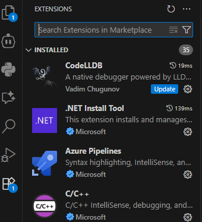
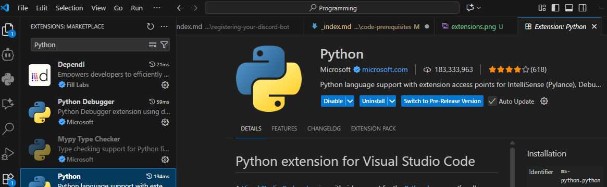
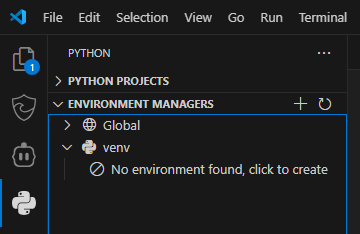
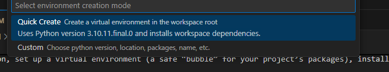
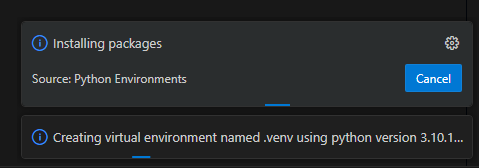
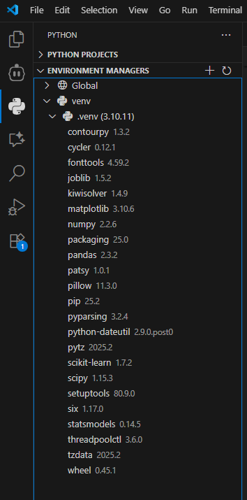
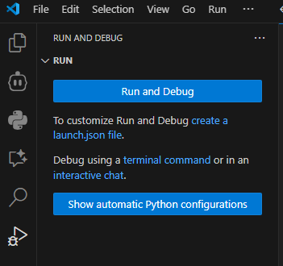
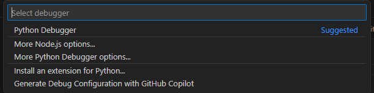
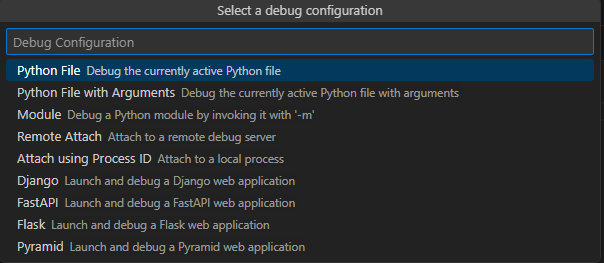
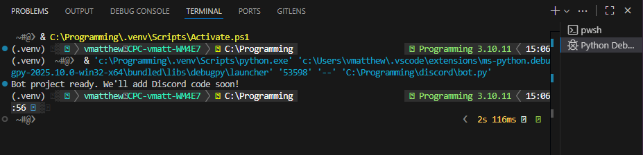

Let’s get your computer ready to run a Discord bot. You’ll install Python, set up a virtual environment (a safe “bubble” for your project’s packages), install VS Code (your code editor), and create the starter files.

## 1. Install Python
Install **Python 3.10** (a 3.10.x version, like 3.10.14) from the official website.
- Windows & macOS: https://www.python.org/downloads/
- (Some Chromebooks may need Linux mode; ask an adult or teacher.)

Why 3.10? Some of the libraries we will use for Discord and translation work best (or only) with Python 3.10 right now. Using a newer version (like 3.11 or 3.12) may cause install errors.

You should see something like `Python 3.10.x`.

## 2. Install VS Code (and the Python tools)

VS Code is a free, student‑friendly code editor where you'll write and run your bot; it gives smart autocompletion, error hints, and an easy way to manage Python.

Download VS Code from: https://code.visualstudio.com/

After VS Code installs, add the Python tooling:
1. Open VS Code and go to the Extensions view (Click on the extensions icon in the Activity Bar on the side or press `Ctrl+Shift+X`).

2. Search for `Python` (Publisher: Microsoft) and click Install. This will install some helpful tools we'll be using throughout the workshop. 
3. Install the `Python Environment Manager` experience if prompted – it is bundled in the Python extension recent versions.
4. Reload VS Code if it asks you to.

You should now see the Python extension symbol on your sidebar.


## 3. Create a Project Folder
Choose a location you can find easily, like your Documents or Desktop.
Example folder name: `discord-translator-bot`.
Open the folder in VS Code (File → Open Folder).

## 4. Create a Virtual Environment
A virtual environment keeps your project separate from other projects and makes it easier to organize all of the Python files on your computer. The VS Code Python extension can create and select it for you.

1. To create the environment, look for the Python symbol on the side bar and click on it: 
1. Click on the "venv" dropdown. It should say something like "No environment found, click to create". Click it.
1. That should bring a dropdown near the top saying "Select environment creation mode". Choose "Quick Create".

1. You should now see a small loading window pop up that indicates that it is creating the virtual environment. This may take a few minutes.

1. Once it is finished, if you select the Python symbol on the side bar again, and clicke the "venv" dropdown, you should see that the virtual environment has been created and selected.


## 5. Create Starter Files
Inside the project folder, create these files:
```
bot.py
requirements.txt
```

### bot.py
This will be where all of the code for your bot goes. For now, just add this starter code:
```python
print("Bot project ready. We'll add Discord code soon!")
```

### requirements.txt 
This can remain empty for now. Later, you will add the names of the Python libraries your bot needs to this file, so they can be installed easily.


## 6. Run the bot script
1. On the sidebar there should also be a "Run and Debug" icon (a play button with a bug). With bot.py open in the main editor, click the icon, then click on the Run and Debug button at the top of the sidebar.


1. In the dropdown that appears, select "Python debugger".


1. Then in debug configurations, select "Python File".


1. Clicking "Run and Debug" again should run the script, and you should see the output in the terminal at the bottom!

