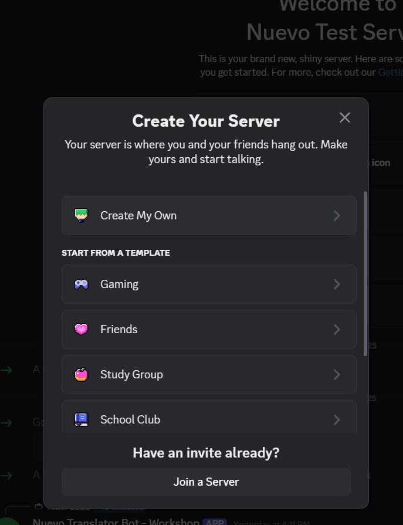



<strong>Nuvi says:</strong> Discord might seem like just another chat app, but it's actually perfect for our bot project! It's where millions of people hang out online— from gamers to study groups. And the coolest part? Discord lets us add bots to make these communities even better.


Nuvi's new community lives on Discord—an online platform where people build communities (called **servers**) to chat using text, voice, or video. You can think of a server like a group for a club, a game, a class, or friends. Inside each server are **channels**. Channels help organize conversations. For example, one channel might be for homework help and another for talking about videogames.

### Key Ideas
- **Servers:** Spaces people create for groups or topics.
- **Channels:** Rooms inside a server (text or voice) for different discussions.
- **Users:** People with accounts who can join servers (sometimes by invite).
- **Bots:** Computer programs (like the one you will build!) that can help with tasks such as moderating chat, translating messages, or playing music.

Discord was first popular with gamers, but now it's used by study groups, hobby communities, and classrooms too. That makes it a perfect place for Nuvi's international friends—if only everyone could read each other's messages.



<strong>Warning:</strong> Stay smart online! Never share personal info like your real name, address, or school with people you don't know in real life. Keep your bot token secret—it’s the bot’s password.


### Safety Note
Never share your personal information (full name, address, phone, school) with strangers online. Keep your bot token (password) secret too (it lets someone control your bot if they get it).

_Source: Adapted from public information on Wikipedia's Discord article._

---

## Create a Test Server for Your Bot
Before you invite your bot, it's best to have a private server where you can experiment safely.



<strong>Nuvi tip:</strong> Making your own server is like having a lab where you can experiment safely. I always test new stuff in a private “Bot Playground” server first.


1. Open the Discord app (or go to https://discord.com/app in a browser and log in).
1. Look at the far left sidebar (the column with server icons). Click the plus button.

1. Choose `Create My Own` (you don't need a template).

1. Pick `For me and my friends`.

1. Give it a name like `Bot Test Lab` or `Translator Bot Dev`.
1. Click `Create`.

You now have a blank server with some default channels (like `#general`). You'll invite your bot here later so you can test out the bot commands

### Keep It Private
Only invite people you trust while you're learning. You can always make a "real" server later once your bot is stable.

Next, you'll learn how to set up your development environment and start coding the bot.

---
