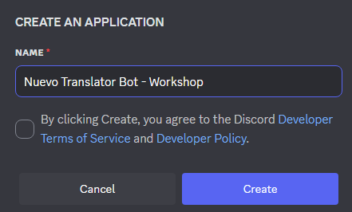

## Overview

Before you can run code for your bot, you must create a "bot identity" in Discord’s Developer Portal. This gives you a **token** (think of this like a password) your bot will use to log in.

### 1. Open the Developer Portal
Go to the [Discord Developer portal](https://discord.com/login?redirect_to=%2Fdevelopers%2Fapplications%3Fnew_application%3Dtrue) and log in with your Discord account (or create one if you don’t have one)

### 2. Create a New Application
Click **New Application**.
- Give it a short, clear name (example: `Nuevo Translator Bot`).
- Click the terms of service checkbox and then **Create**.

### 3. Add a Bot User
Inside your application page:
- Click **Bot** in the left menu.
- Click **Add Bot** → **Yes, do it!**
- (Optional) Give it an icon and nickname.

### 4. Copy the Bot Token (But Keep It Secret!)
Still on the Bot page:
- Click **Reset Token** or **Copy Token**.
- This long string is like a password for your bot.
- Never post it publicly

### 5. Enable Privileged Intents (If Needed)
Scroll down to **Privileged Gateway Intents** and toggle on:
- `MESSAGE CONTENT INTENT` (needed if you want to read message text in most libraries)
You can leave others off for now.

### 6. Invite Your Bot to a Server
- Click **OAuth2 → URL Generator**.
- Under **Scopes** check: `bot`.
- Under **Bot Permissions**, select only what you need now (start simple: `Read Messages/View Channels`, `Send Messages`).
- Copy the generated URL, paste it into your browser, choose a server you own or manage, and authorize.

Your bot is now registered and added to your server! It won’t come online until you run your Python code with the token.

### Next Step
Set up your coding environment and create a simple script to make the bot go online.
