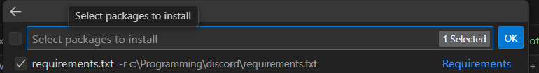
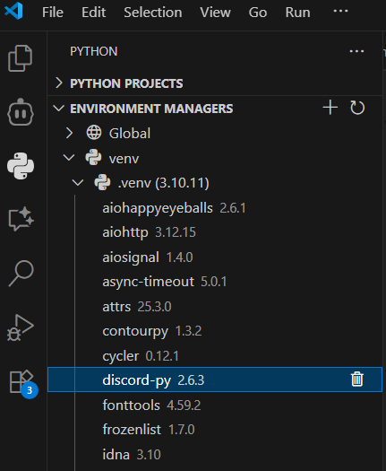
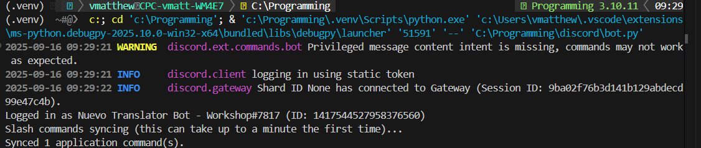

## Overview
Now that your project folder, virtual environment, and starter file are set up, you’re ready to build a simple Discord bot. In this part, you will:
1. Add `discord.py` to `requirements.txt` and install it using the VS Code Python extension (UI only — no terminal typing required)
2. Add your bot token safely using a `.env` file
3. Write a basic bot that responds to a slash command `/hello`
4. Run and test the bot

---

## 1. Add and Install the discord.py Library (Using requirements.txt + VS Code UI)
We’ll declare the dependency first, then let VS Code install it into your virtual environment.

### 1.A Add it to requirements.txt
1. Open `requirements.txt` in your project.
2. Add this line (the file can just contain this for now):
```
discord.py
```
3. Save the file

### 1.B Install via the Environment Manager UI
1. Open the Python extension view (Python icon in the Activity Bar) and confirm the correct environment (e.g. `.venv`) is selected.
1. Select the "Packages" icon (it looks like a box) which will show a dropdown. Now select "Install project dependencies"

1. Click the checkbox for "requirements.txt" and click "Ok"

1. Wait until `discord.py` appears in the installed packages list.



## 2. Create / Update the .env File (Add Token)
Your bot needs a secret Token from the Discord Developer Portal.

1. Go to https://discord.com/developers/applications
2. Open your application, go to the “Bot” tab, and copy the **Bot Token** (you may need to click *Reset Token* if none is visible). Treat it like a password.
3. In your project folder (where `bot.py` lives), create a file named `.env` if you don’t already have one.
4. Add this line (replace YOUR_TOKEN_HERE with the token you copied):
```
DISCORD_BOT_TOKEN=YOUR_TOKEN_HERE
```

The `.env` file should NOT be shared or uploaded publicly.


## 3. Write the Bot Code
Open `bot.py` and replace any placeholder code with the following:
```python
import discord
from discord.ext import commands

TOKEN = "<your token here>"

bot = commands.Bot(command_prefix="!", intents=discord.Intents.default())

@bot.event
async def on_ready():
	print(f"Logged in as {bot.user} (ID: {bot.user.id})")
	print("Slash commands syncing (this can take up to a minute the first time)...")
	try:
		synced = await bot.tree.sync()
		print(f"Synced {len(synced)} application command(s).")
	except Exception as e:
		print(f"Error syncing commands: {e}")

@bot.tree.command(name="hello", description="Says hello!")
async def hello_command(interaction: discord.Interaction):
	user_name = interaction.user.display_name
	await interaction.response.send_message(f"Hello {user_name}!")

if not TOKEN:
	raise RuntimeError("DISCORD_BOT_TOKEN is missing. Did you put it in the .env file?")

bot.run(TOKEN)
```

### What this does:
- Loads your secret bot's password from `.env`
- Registers a slash command `/hello`
- Replies with a personal greeting!

**Beware !** putting your BOT_TOKEN directly in the code is not advised

---

## 4. Run the Bot
1. Open `bot.py` in the editor.
2. Open the Run & Debug view (play icon with a bug).
3. If asked to select a configuration, choose `Python File`.
4. Click the green Run/Debug button.
5. Watch the Debug Console / Terminal for:
```
Logged in as <your bot name>
Synced X application command(s).

```

If you see errors about the token, make sure the `.env` file is saved and correctly spelled.

---

## 5. Test the /hello Command in Discord
1. Invite your bot to a server where you have permissions (you can generate an OAuth2 URL from the Developer Portal under "OAuth2 → URL Generator" with the `bot` and `applications.commands` scopes).
2. In any text channel where the bot is present, type `/hello`.
3. If slash commands don’t autocomplete yet, wait up to a minute (first sync can be slow) or try re-inviting the bot.
4. You should see: `Hello YourName!`


## 6. Troubleshooting
| Problem | Possible Fix |
|---------|--------------|
| `DISCORD_BOT_TOKEN is missing` error | Ensure `.env` is in the same folder as `bot.py` and the variable name matches exactly. |
| Slash command not showing | Wait 1–2 minutes, ensure the bot is in the server, and that `applications.commands` scope was included in the invite. |
| `403` or permissions error | Recreate invite URL with needed scopes. |
| Wrong Python environment / import errors | Verify the `.venv` is selected in the Python extension view; reinstall `discord.py` there. |
| `ModuleNotFoundError: discord` | The package isn’t installed in the selected environment—reinstall via the Packages UI. |
| Bot shows online but no response | Confirm you used `/hello` (slash command), not `!hello`. |


