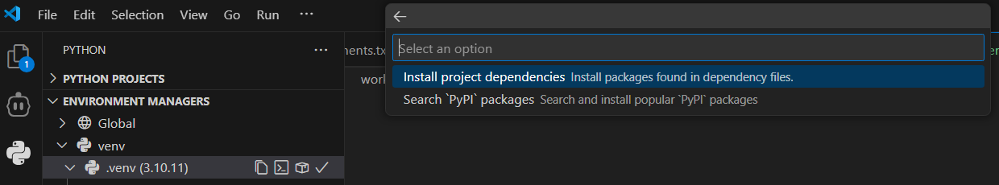

Nuvi now has a registered bot identity. Next: make it actually respond. With your project folder, virtual environment, and starter file ready, you’ll build a **minimal bot foundation**. This first version just proves the connection works. We also turn on one permission (`message_content`) now so later pages can add auto‑translation without revisiting setup.

In this part, you will:

1. Add `discord.py` to `requirements.txt` and install it (VS Code UI — no terminal typing required)
2. Write a basic bot that responds to a slash command `/hello`
3. Enable the message content intent (needed later for auto‑translation)
4. Run and test the bot



<strong>Nuvi says:</strong> Your first goal is just to see the bot come online—translation comes later. Small wins keep momentum!


---

## 1. Add and Install the discord.py Library (Using requirements.txt + VS Code UI)
We’ll declare the dependency first, then let VS Code install it into your virtual environment.

### 1.a Add it to requirements.txt
1. Open `requirements.txt` in your project.
1. Add this line (the file can just contain this for now):
```
discord.py
```
1. Save the file

### 1.b Install via the Environment Manager UI
1. Open the Python extension view (Python icon in the Activity Bar) and confirm the correct environment (e.g. `.venv`) is selected.
1. Select the "Packages" icon (it looks like a box) which will show a dropdown. Now select "Install project dependencies"

1. Click the checkbox for "requirements.txt" and click "Ok"

1. Wait until `discord.py` appears in the installed packages list.


## 2. Write the Bot Code
Open `bot.py` and replace any placeholder code with the following. (You’ll notice a `user_languages` dictionary already—this is a “placeholder notebook” we’ll actually start using when we add registration and auto‑translation soon.)
```python
import discord
from discord.ext import commands

TOKEN = "<your token here>"

# This is where we remember which language each user wants
# It's like a notebook: user_languages[user_id] = "en" or "es"
user_languages = {}

# Tell Discord our bot needs to read messages (not just commands)
intents = discord.Intents.default()
intents.message_content = True
bot = commands.Bot(command_prefix="!", intents=intents)

@bot.event
async def on_ready():
    print(f"Bot is online as {bot.user}!")
    try:
        synced = await bot.tree.sync()
        print(f"Synced {len(synced)} commands.")
    except Exception as e:
        print(f"Error: {e}")

@bot.tree.command(name="hello", description="Says hello!")
async def hello_command(interaction: discord.Interaction):
    await interaction.response.send_message(f"Hello {interaction.user.display_name}!")

if not TOKEN:
    raise RuntimeError("Bot token missing. Add it to the TOKEN variable near the top of the file.")

bot.run(TOKEN)
```

### What this does:
- Imports the Discord library so you don’t reinvent networking.
- Sets up “intents” and enables `message_content` early (future auto‑translation needs to read messages).
- Creates and starts a bot connection.
- Registers a slash command `/hello` to prove command syncing works.
- Uses `user_languages = {}` as a simple in‑memory place we’ll fill later.
- Replies with a personal greeting when `/hello` runs.
- Safety check: stops if the token is missing.

<details>
<summary><strong>-> Advanced details (click to expand if you'd like to learn about more of the advanced concepts used here. Totally optional!)</strong></summary>

**async / await**: These keywords let Python run other tasks while waiting (for example, for Discord to reply) so your bot doesn’t freeze.

**Event (@bot.event)**: Decorators like `@bot.event` tell the library “run this function when a specific event happens” (here: when the bot is ready).

**Slash commands (`@bot.tree.command`)**: These create modern commands that appear when users type `/` in Discord. They’re registered with Discord’s servers and may take a short time to sync.

**Interaction**: Represents a user using a slash command. `interaction.user` gives you the person, and `interaction.response.send_message(...)` sends a reply.

**Bot vs Client**: `commands.Bot` adds helpful command features (like command trees) on top of the lower-level Discord client.

**Intents**: Permissions telling Discord what data you want (messages, members, etc.). Using fewer keeps your bot simpler and safer.

**Exceptions (try / except)**: The `try:` block runs code that might fail; `except Exception as e:` catches errors so your bot can log them instead of crashing.

</details>


<strong>Beware!</strong> Putting your BOT_TOKEN directly in the code is not advised in normal circumstances, this is just for workshop simplification. Normally should use environment variables or a secure storage location.

---

## 3. Run the Bot
1. Open `bot.py` in the editor.
1. Open the Run & Debug view (play icon with a bug).
1. If asked to select a configuration, choose `Python File`.
1. Click the green Run/Debug button.
1. Watch the Debug Console / Terminal for:
```
Logged in as <your bot name>
Synced X application command(s).

```


---

## 4. Test the /hello Command in Discord
1. Invite your bot to a server where you have permissions (you can generate an invite link from the Developer Portal under "OAuth2 → URL Generator" with the `bot` and `applications.commands` scopes, as well as the `Send Messages` text permission).


.
1. Copy the url and paste it into your browser. That should open a Discord page asking you to select a server to invite the bot to. Select your test server.

1. Make sure the bot is running, you should see it online in the member list.

1. In any text channel where the bot is present, type `/hello`.
1. You should see: `Hello <your Discord username here>!`




<strong>Nuvi tip:</strong> If `/hello` doesn’t autocomplete right away, wait up to 60 seconds or restart the bot—Discord is syncing commands.


## 5. Troubleshooting
| Problem | Possible Fix |
|---------|--------------|
| `DISCORD_BOT_TOKEN is missing` error | Ensure the `TOKEN=...` line is present |
| Slash command not showing | Wait 1–2 minutes, ensure the bot is in the server, and that `applications.commands` scope was included in the invite. |
| `403` or permissions error | Recreate invite URL with needed scopes. |
| Wrong Python environment / import errors | Verify the `.venv` is selected in the Python extension view; reinstall `discord.py` there. |
| `ModuleNotFoundError: discord` | The package isn’t installed in the selected environment—reinstall via the Packages UI. |
| Bot shows online but no response | Confirm you used `/hello` (slash command), not `!hello`. |
