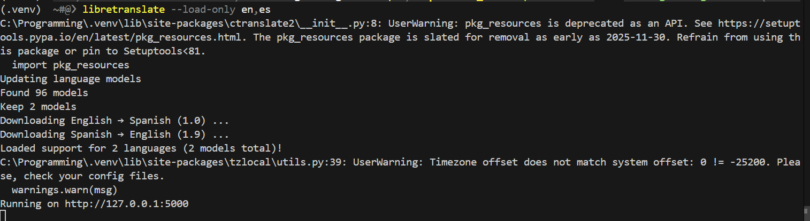

## 1. Add it to requirements.txt
Open your project’s `requirements.txt` and add (or confirm these lines are present):
```
libretranslate
requests
```
Save the file.

### Install using the VS Code terminal
To open the terminal you can:
- Use the menu: View → Terminal
- OR press the keyboard shortcut: `Ctrl+`` (backtick key, usually above Tab). On macOS it’s `Cmd+``.
- OR click the Terminal tab / plus (+) icon at the top of the panel area.

1. Make sure your virtual environment is selected (look for `.venv` in the bottom status bar). If not, select it.
2. Open a new terminal in VS Code (``Ctrl+` ``).
3. Run:
```pwsh
pip install -r requirements.txt
```
4. Wait for the install to finish without errors.
5. (Optional) List installed packages to verify:
```pwsh
pip show libretranslate
```

---

## 2. Run LibreTranslate Locally
Start the server in the terminal (keep this window open while you test):

```bash
libretranslate --load-only en,es
```
This will start the server with support for translating English and Spanish.

The first time running it may download language data. That can take a few minutes.



Once it's finished, open a browser to:
```
http://127.0.0.1:5000
```
You should see a simple page. To see languages the server supports, visit:
```
http://127.0.0.1:5000/languages
```

---

## 3. Troubleshooting
| Problem | Fix |
|---------|-----|
| `No module named libretranslate` | Ensure your terminal shows the (.venv) text or ask an adult for help. |
| Server starts then quits | Read the error text; reinstall or try again. |
| Can’t open 127.0.0.1:5000 | Make sure the server is still running; check firewall. |
| First translation slow | Models still loading. Wait a bit. |
| Output is empty / weird | Make sure you used POST with keys: `q`, `source`, `target`, `format`. |
| Port already in use | Use a different one: `python -m libretranslate --port 5001` and update the URL. |

---

## 4. Next: Test a Translation
Move on to the Test a Translation page to try a quick Python script that calls the `/translate` endpoint.
