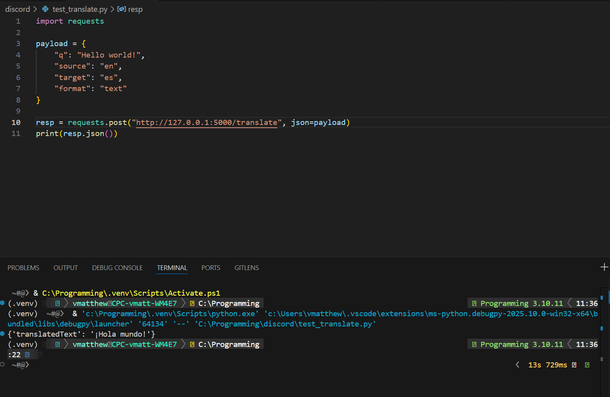

## Test a Translation (Quick Script)
Nuvi needs proof the translator engine actually works before wiring it into the bot. This tiny script is that proof.

Let’s send some text to the server using a short Python file.

Create a new file named `test_translate.py`:
```python
import requests

payload = {
    "q": "Hello world!",
    "source": "en",
    "target": "es",
    "format": "text"
}

resp = requests.post("http://127.0.0.1:5000/translate", json=payload)
print(resp.json())
```

Run it (make sure the LibreTranslate server is still running):
1. Open `test_translate.py` in the editor.
1. Click the Run & Debug icon (play button with a bug) on the left.
1. Look in the Debug Console / Terminal panel for output.

You should see something like: `{'translatedText': '¡Hola Mundo!'}`



---

### What’s happening here?
**requests library:** A popular Python helper that makes it easy to talk to websites or local servers without writing a lot of low-level code.

**Web request:** A message your program sends to a server asking it to do something (here: translate text) and give back a response.

**Payload:** The data you send along with a request. In this script, `payload` represents the data, like the text to translate and the source/target languages, stored as JSON.

**JSON:** A simple text format for data. The server sends its answer as JSON so different programs and languages can read it.

**resp.json():** This converts the JSON reply from the server into something Python understands.



<strong>Nuvi tip:</strong> If you get a connection error, double-check the server terminal is still running and the URL is `http://127.0.0.1:5000`.


**Endpoint:** The specific URL (`/translate`) on the server that performs a task—in this case, translation.

Now you know each piece! Next you’ll connect this idea to your Discord bot so Nuvi’s friends can finally understand one another.
