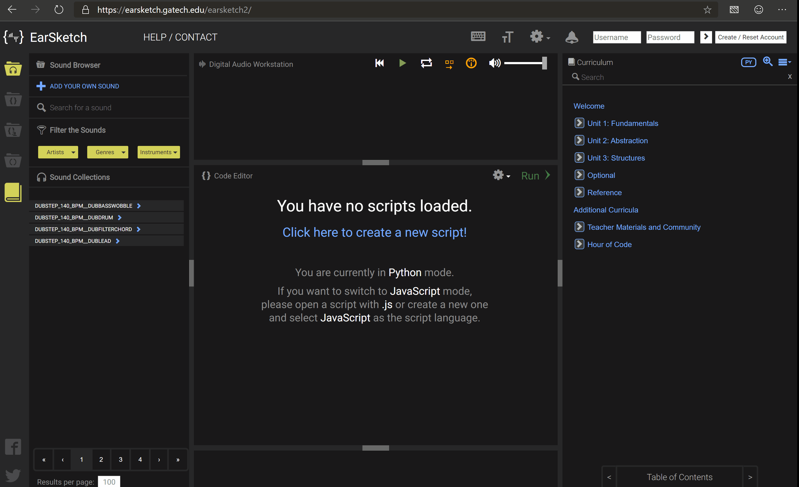
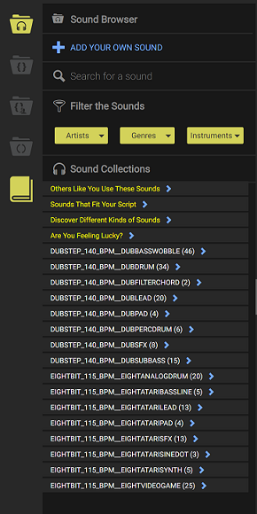
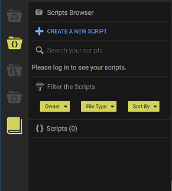
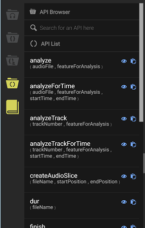

<iframe width="100%" height="500px" src="https://www.youtube.com/embed/apUsNWZ9wIE" frameborder="0" allow="accelerometer; autoplay; encrypted-media; gyroscope; picture-in-picture" allowfullscreen></iframe>

[EarSketch](https://en.wikipedia.org/wiki/EarSketch) is a free educational programming environment developed at Georgia Institute of Technology. We will be composing music using EarSketch today.

1.  To make music, click on
    [EarSketch](https://earsketch.gatech.edu/earsketch2/) to open it in a new tab.
    
2.  Now, let's get started. Click on *Scripts* icon on the left menu bar and
    select *Create a new script*. When prompted to enter the script
    name, enter *myjam* and click on *Create* button.
    
3.  Do not delete any of the pre-existing code! We will insert our code in between them.

{} 

#### Recommended for Teachers - Overview of EarSketch
Please take a look at overview of EarSketch before you start with the class. It is important to know how to navigate back and forth in the UI.

The `navigation bar` on the left side of the screen is your homebase for navigating through all that EarSketch has to offer.

1. The first item of the navigation bar is the `Sounds` collection. It is the central location for all the pre-loaded sounds that earsketch has to offer. In the sound browser, you can filter which sounds appear based on the artists, the genre, or instruments.
    

2. The next icon on the navigation bar is the `Scripts` pane. This is where we will write our code.
    

3. The next (third from top) icon is the `Share` section. You can use this to save your code, download or share it with your friends. We will skip this section for this exercise.

4. The last two icons on the navigation bar are the `API Browser` and the `Curriculum` guides.

We will use `API browser` to make music. An *Application Programming Interface* or *API* is a set of code that is ready for you to use right away! You may notice two icons to the right of each API. The first icon provides a description of the API and an example on how to use the API. The second icon copies and pastes the API into the code editor, so you do not even need to type it! We
will use a couple of these in the coming sections.

The last icon in the above picture shows the `Curriculum` guide. If you want to know more about EarSketch, you can explore the section that appears on the right side of the window when you click on it. We will skip this section for this exercise.

{}