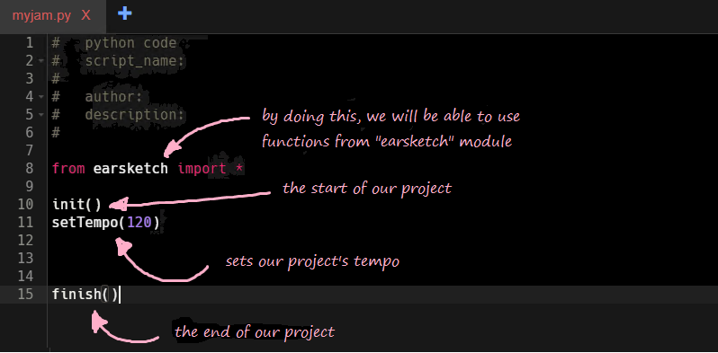
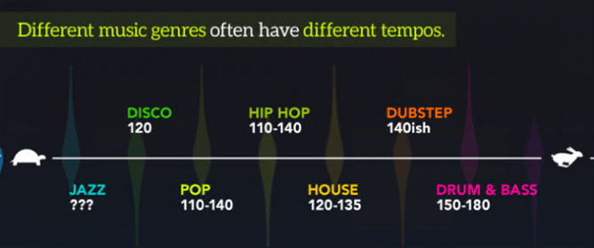
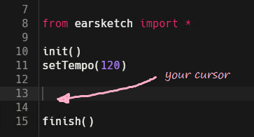
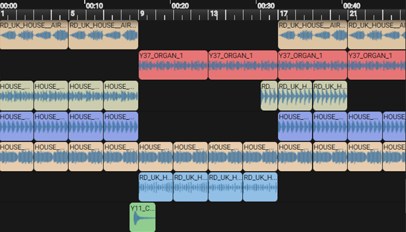

Let's take a closer look at the pre-existing code and understand what it means.  We will be placing our new code between the `setTempo()` and `finish()` functions. The `setTempo()` function allows you to set the overall project tempo.

{}
**Quick Fact**: Tempo is the speed at which a piece of music is played. Changing a project's tempo allows for different styles of music to be created. Try changing the tempo of your `setTempo` function and see what happens! Please make sure it is a number
between 45-220. 

{}

{}

1. Now that our tempo is set, it is time to add sounds. To do so, we will use the `fitMedia()` function.
2. Make sure the cursor in your program is between `setTempo()` and `finish()` functions.
    
3. Navigate to the <b>Api Browser</b> icon on the left side menu. Scroll through the list to the `fitMedia()` function. 
4. Click on **Paste** icon on the right corner of `fitMedia()` to insert the function.
5. Replace the pasted in text with `fitMedia(YG_TRAP_ELECTRIC_PIANO_FILTERED_1, 3, 1, 17)`.
6. Press run, then click on play to listen to the audio clip! 

{}

{} 
## HELP! Nothing happens!

Make sure the capitalization of the method call is correct. Most programming languages, Python included, are case sensitive. This means that adding capital letters can call a different function than expected. For example: `fitMedia()` is not the same as `FitMedia()`.
{}

{}

Digital Audio Workstation (DAW) is the area which the sounds appear in. It is at the center top of your EarSketch window. The following is an example of how different sections of a song may look in the DAW. 
{}

### Video Walkthrough

<iframe width="100%" height="600px" src="https://www.youtube.com/embed/3OpCc7sKcpM" frameborder="0" allow="accelerometer; autoplay; encrypted-media; gyroscope; picture-in-picture" allowfullscreen></iframe>
