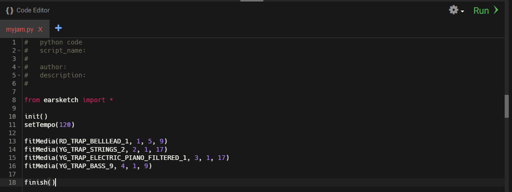

Now that you have learned how to add sounds to Earsketch, let's try and make a song! You should already have one audio clip in Earsketch, but
songs are made up of various instruments, so we need to add more audio clips.

{}

1.  Add another `fitMedia()` call.
2.  Find another audio clip you would like to add to your current song and input it under the `fileName` parameter.
3.  The `trackNumber` parameter should be a unique number. This will allow us to place our sounds on different tracks. Having different sounds on different tracks allows us to maintain organization of our sounds and play different sounds at the same time. 
    
    Example: If the first `fitMedia()` call is on track 1, the second `fitMedia()` call should be on track 2.
4.  Complete the rest of the parameters.
5.  Repeat these steps until you have <b>four</b> different audio sounds in your song.

{}

Your code should now look something like this:

### Video Walkthrough

<iframe width="100%" height="600px" src="https://www.youtube.com/embed/OvSvko6Y4io" frameborder="0" allow="accelerometer; autoplay; encrypted-media; gyroscope; picture-in-picture" allowfullscreen></iframe>
