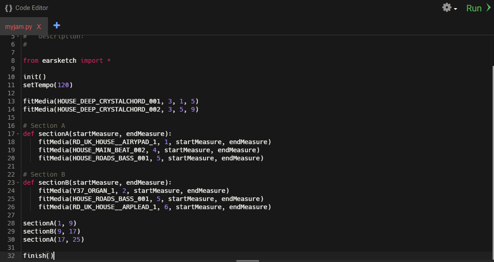

In Earsketch, functions are mostly used to organize different sections of a song. The most common musical form is A-B-A where each section is
four measures in length, and the A sections sound different from the B section.

Now that we learned how to use functions, let's try to use them to organize our songs better.

{}

1.  Define your function with a `startMeasure` parameter and
    `endMeasure` parameter.
2.  Place the sounds you would like to have the function represent underneath your function definition.
3.  Try to make multiple sections of a song (verse, chorus, intro, etc.) and define them with your functions. If you don't do this, and only use multiple `fitMedia` calls, you will notice that your program will become long and hard to understand. To help avoid having a large project file, use functions!

{}

Your code should now look something like this:

### Video Walkthrough

<iframe width="100%" height="600px" src="https://www.youtube.com/embed/ENPl4QnJg1I" frameborder="0" allow="accelerometer; autoplay; encrypted-media; gyroscope; picture-in-picture" allowfullscreen></iframe>
