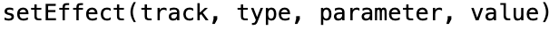
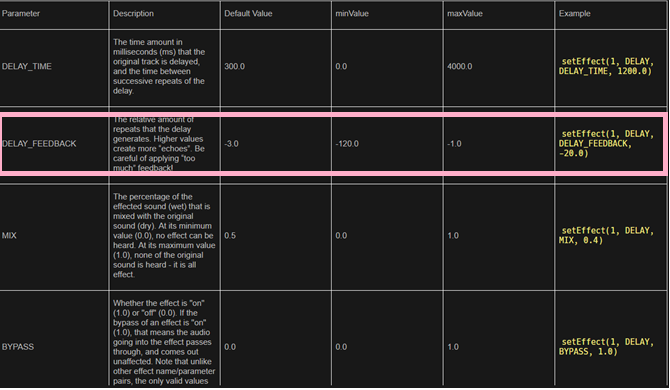

Effects in EarSketch
-------------------------------------
<b>Effects</b> allow the producer to alter the sound of the audio clip
into its own unique sound. Similar to how we used `fitMedia()` to add
new audio clips, we must use the `setEffect()` function to define
specific effects for each audio clip. It is important to note that
multiple effects can be placed on the same track. This allows for the
producer to combine multiple effects together. Earsketch has many
effects built-in. To reference all the effects, visit this
[link](https://earsketch.gatech.edu/earsketch2/#?curriculum=5-1-0&language=python) and make sure *Curriculum* pane is selected in the navigation bar.

Before we start adding effects to our song, let's breakdown the pieces
of the two `setEffect` functions:

-   `track`: The track number to which the effect is applied to. Note:
    To apply an effect to the Master track, use 0 as the value for
    track. The master track is where all the audio is collectively
    played together. This is an easy way to apply an effect to all the
    sounds being processed.
-   `effectType`: The specific effect being used
-   `effectParameter`: The setting for the effect being used
-   `effectValue`: The value applied to the effectParameter

## Add setEffect function to your song

Since we are more familiar with using effects, let's add an effect to our song.

{}

1.  On the API browser on the left, scroll to `setEffect` API.
2.  Insert a `setEffect` function call into your code, using the paste icon.
3.  We need to replace the parameters with our own values. Put an integer value for `trackNumber`. Let's put 2.
4.  For the rest of the effect parameters, click on the eye icon on the `setEffect` API and you will see a link to "Every Effect Explained in Detail". Click on it to open this section on the right side of your window.
5.  You may notice that Earsketch has many different variations of effects. By default, you should see section 30.4 BANDPASS on the right. For now, we will use the DELAY from section 30.4 as `effectType` in our `setEffect` function call.
6.  Now that we have chosen our `effectType`, we need an `effectParameter`. Navigate to section 30.4 on the right to check out different parameters supported for DELAY. Here is a picture of that section. We recommend using the DELAY\_FEEDBACK.
    
7.  For the final parameter, input a valid value. Since we have chosen DELAY\_FEEDBACK, we must specify a number between -120.0 and -1.0 (as shown in the picture above). 

    Example: Use -6.0 as your effect value for DELAY\_FEEDBACK.

{}

Your code should now look something like this:

### Video Walkthrough

<iframe width="100%" height="600px" src="https://www.youtube.com/embed/R_eo0B8qDW0" frameborder="0" allow="accelerometer; autoplay; encrypted-media; gyroscope; picture-in-picture" allowfullscreen></iframe>
