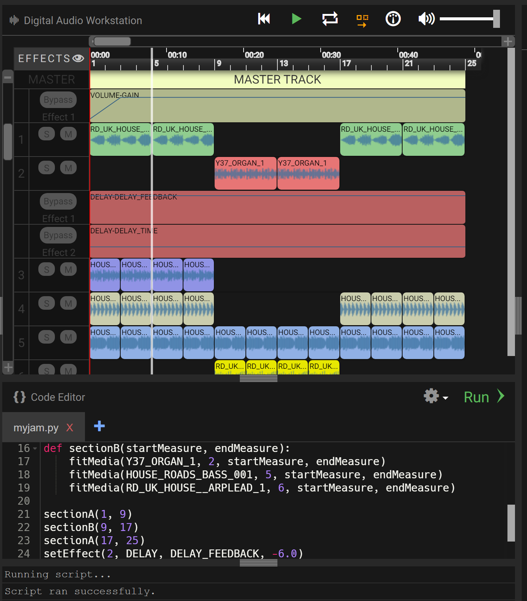

<iframe width="560" height="315" src="https://www.youtube.com/embed/g0u1CkbpUWQ" frameborder="0" allow="accelerometer; autoplay; encrypted-media; gyroscope; picture-in-picture" allowfullscreen></iframe>

### Let's make some music!

Welcome to this introductory guide on how to make music using
[EarSketch](https://en.wikipedia.org/wiki/EarSketch) & Python. To jump to a particular activity, click on the section link below:

<!--- LEAVING THIS VIDEO HERE IN CASE IT IS NEEDED 
<iframe width="560" height="315" src="https://www.youtube.com/embed/g0u1CkbpUWQ?start=79" frameborder="0" allow="accelerometer; autoplay; encrypted-media; gyroscope; picture-in-picture" allowfullscreen></iframe>
 --->

### Meet DJ Nuevo

### Nuevo has new headphones! Can you find yours?

You got contacted to make Nuvi's next hit mixtape, but when you get to the studio, Nuvi says their next project is going to be produced all in code. This is something that hasn't been done before, are you up to the challenge? Look around yourself to find your headphones and get ready to
join him!

Before we start, make sure that your headphones are working. Try playing the following audio. What do you hear?!

<figure>
    <audio
        controls
        src="../audio/good-enough.mp3">
            Test audio to see if your browser supports the audio element. If you cannot play the audio, it likely means your browser does not support this. 
            <code>audio</code> element.
    </audio>
</figure>

## Table of Contents

Table of Contents

{}

