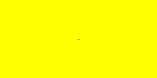

### Pixels

**Pixels** is a small area of color on a display screen. Images are formed by pixels on the screen. We can manipulating pixels by changing the **RGB Value**, which are essentially changing the value of red, green and blue color on each pixels.
<br/><br/>

For information about how to open and save images in Python. <br/>
See more on these pages: <br/>
<a href="../../../image-manipulation/project-overview/" target="blank">Import PIL</a><br/>
<a href="../../../image-manipulation/open-image/" target="blank">Open an Image</a>
<br/><br/>
#### Making image using pixels
```python
# Remember to import Image
from PIL import Image
Image.new(mode, size)
Image.new(mode, size, color)
```
`Image.new()` creates a new image with the given mode and size. Here, we only use `RGB` as mode. Size is a `(width, height)` value of image. Color is the RGB Color of that pixels. We can also use color names. If you do not initialize color value, the image is filled with black.
<br/><br/>

#### Let's see some examples

```python
# Remember to import Image
from PIL import Image
img=Image.new('RGB', (200,100),(100,100,100))
img.save('pil_grey.png')
```
output:

```python
# Remember to import Image
from PIL import Image
img=Image.new('RGB', (200,100),"black")
img.save('pil_black.png')
```
output:


#### Changing a pixel in image
```python
# Remember to import Image
from PIL import Image
img=Image.new('RGB', (200,100),"yellow")
img.putpixel( (100,50), (0, 0, 0))
img.save('pil_black-dot.png')
```
output:

You can see a tiny small dot in the middle of this yellow block, this is one small pixel. 
