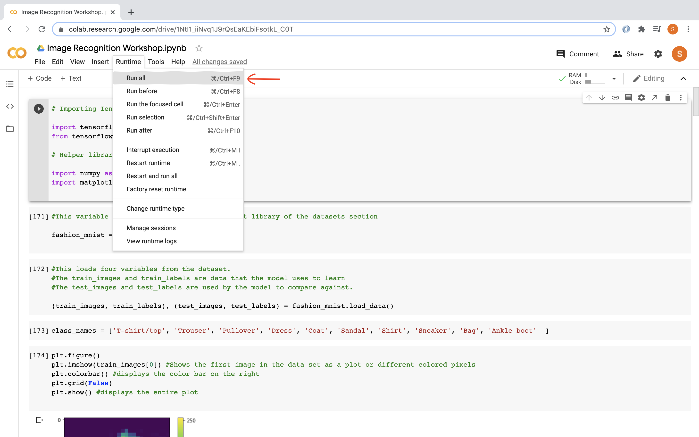

# Welcome to Tensorflow!
In this workshop we will be using the Tensorflow Python library to train a neural network model to recognize and classify different types of clothing. We will take a look at the steps which allow the model to make a prediction for the best fit category for a specified image.

You can also use [this video](https://www.youtube.com/watch?v=FiNglI1wRNk) to follow along with this workshop to help better understand what is covered.

The following videos will go over all the code and activities, so we recommend doing the activities first before looking at the walkthrough solutions.

<iframe width="100%" height="600px" src="https://www.youtube.com/embed/6FfxBNRn0Ww" frameborder="0" allow="accelerometer; autoplay; encrypted-media; gyroscope; picture-in-picture" allowfullscreen></iframe>

## Getting Started with Google Colab
Visit [Google Colab](https://colab.research.google.com/), an online programming environment similar to Google Docs but for running code. After signing into your Google account, click the option to create a "New Notebook". To run the code you complete while working through this workshop, click on the "play" button on the left. 

We recommend that you organize your code by creating a new block of code for every segment of code used in the activities throughout the workshop. Also, make sure to read the comments in the code blocks to better understand what each code segment does.

{}
### Google account required
In order to use Google Colab to edit and run code, you need to be logged in to your Google account (or school account with access to Google services/ Google Drive). 

### Don't have a Google account?
If you do not have a Google account and are not able to create one, please contact any of the admins of Nuevo Foundation to get temporary access to a Nuevo account for this workshop only. Please keep in mind that Google Colab is required for this workshop so that you can run all the code.

{}

{}
When running your code for the first time, make sure to run your code by clicking on _Runtime -> Run all_ in the Menu bar to execute all your code snippets sequentially. This is to make sure that you don't accidentally execute functions without importing the libraries first!

{}

## Table of Contents

Sections

{}

 

<a href="https://www.tensorflow.org/tutorials/keras/classification" target="_blank">Works Cited</a>

