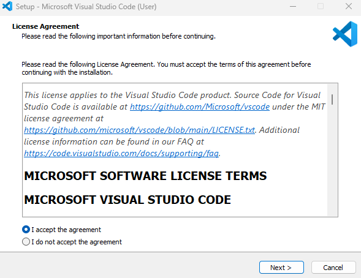

## Welcome

The goal of today's activity is to learn Web and C# skills and incorporate your new-found knowledge to create a web site!

## Starting Up

The goal of today's activity is to learn Web and C# skills and incorporate your new-found knowledge to create a web site! Let's get your environment set up.

Before you get started with C# application development, your first step is to select a programming environment. For this workshop, we've chosen Visual Studio Code, one of the most popular IDEs among C# developers. 

### Download Visual Studio Code
1. Open a new browser window, and then navigate to: <a href="https://code.visualstudio.com" target="_blank">https://code.visualstudio.com</a>.

2. In the browser window, select Download button.

> Note
> 
> The Download page for Visual Studio Code automatically detects your operating system. It displays the version to download for your operating system, such as Linux, macOS, or Windows.

3. Wait for the installer file to finish downloading.

The name of the installer file will be similar to the following (for a Windows PC): VSCodeUserSetup-x64-1.81.0.exe.

>  Note
>
> The file name depends on the current version of Visual Studio Code and your computer’s operating system.

4. Close your browser window.

### Install Visual Studio Code
1. On your PC, open a file explorer application, and then navigate to your computer’s downloads folder.

2. In your file explorer application, select and run the Visual Studio Code installer file.

    On a Windows PC, you can double-click the installer file to begin the install process. For example, double-click VSCodeUserSetup-x64-1.81.0

>Note

>You can install Visual Studio Code using either the User Installer or System Installer. The User Installer installs Visual Studio Code just for the current user, while the System Installer installs Visual Studio Code for all users. The User Installer is the recommended option for most users.

After a moment, the **Setup - Microsoft Visual Studio Code** dialog window will appear.

3. Select I accept the license agreement, and then continue following the online instructions to complete the installation.

    Accept the default options during the remainder of the installation.

    For detailed installation instructions, see the following Visual Studio Code documentation page: <a href="https://code.visualstudio.com/docs/setup/windows" target="_blank">https://code.visualstudio.com/docs/setup/windows</a>.

### Install .NET SDK

> Note
> 
> You can check to see if you already have .NET installed by opening a Terminal window and typing <code>dotnet --version</code> and pressing the Enter key.

1. Open a new Internet browser window.

2. To open the download page for the .NET SDK, navigate to the following URL:

    <a href="https://dotnet.microsoft.com/download" target="_blank">https://dotnet.microsoft.com/download</a>

3. On the Download .NET page, select the recommended version of the .NET SDK.

4. Wait for the installer file to finish downloading.

5. Run the .NET SDK installer file.

    On a Windows PC, you can find your Downloads folder using File Explorer. Double-click the installation file to begin the installation process.

6. On the .NET SDK Installer window, select Install.

7. Wait for the installation to complete.

    Installation should take about a minute. Once installation is complete, a message displays confirming the installation was successful.

8. To close the installer window, select Close.

## Table of Contents

Table of Contents

{}

