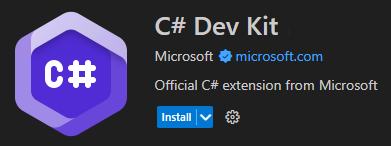

## Instructions

### Configure Visual Studio Code Extensions
Now that you're familiar with the Visual Studio Code user interface, your next step is to configure Visual Studio Code for C# coding.

1. Ensure that you have Visual Studio Code open.

2. On the **Activity bar**, select **Extensions**.

3. In the **Search Extensions in Marketplace** textbox, enter **C#**

    Entering "C#" filters the list of extensions to show only the extensions that have something to do with C# coding.

4. In the filtered list of available extensions, select the extension labeled "C# Dev Kit - Official C# extension from Microsoft" that's published by Microsoft.

    There's lots of information about the C# extension that you could read. For now, the important thing to know is that this extension helps you to develop, edit, and debug C# code in Visual Studio Code. You can come back later to read about the extension if you want.

5. To install the extension, select Install.

    The Install button changes to Installing. This extension should install quickly.

6. Close the C# Dev Kit page in the Editor.

7. On the EXTENSIONS view, clear the text C# from the Search textbox.

    The EXTENSIONS view will refresh to show all of the INSTALLED extensions at the top of the list. Popular and recommended extensions are listed below the installed extensions.

8. Notice that installing the C# Dev Kit installs the following extensions:

* C# Dev Kit - Official C# extension from Microsoft.
* C# - Base language support for C#.
* IntelliCode for C# - AI-assisted development for C# Dev Kit.
* .NET Runtime Install Tool.

    These four extensions are the only ones that you need for now.
