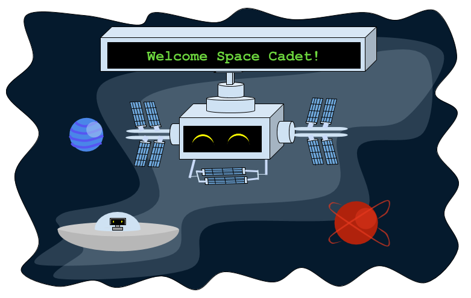



# Introduction: Learn SQL by Saving the Galaxy!

## Welcome to the Nuevo Space Station (NSS)! 

You are a space adventurer who travels the galaxy in your speedy rocket ship while solving coding puzzles to help save your alien friends on different planets.
 
You’ve been approved as an honorary space explorer by the Galactic Federation! You will be given missions to help make the galaxy a safe and fun place for everyone!

{}
Please do not use the Firefox browser for this workshop.
{}

## Table of Contents

{}
