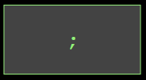

<!-- Links for javascript and CSS needed for drop down logic -->
<link rel="stylesheet" href="../default/_default.css" type="text/css"></link>
<link rel="stylesheet" href="_activity1.css" type="text/css"></link>

# Mission 1: Save the Planet of Fun From Boredom!
Your first mission is to go to the Planet of Fun and save them from boredom! 
You are sent a database about the planet and you need to learn how to use SQL 
commands to help save the Planet of Fun!

## Task 1: Take a peek at the information on the Planet of Fun
You are given information about the Galaxy and want to look for the Planet of Fun. To do this,
 the Galactic Federation has given you your first SQL command: SELECT. 

### What the command does: 
The SELECT command allows you to choose what data to show from a database.

### Example:

#### Now use what you learned! **Rearrange the code blocks below to answer the question and continue your space adventure!**

#### Question: What command will display all the columns in the database called "galaxy"?



<!-- Rectangles to Receive blocks -->

 

 

 

 

 

 

  

 

<!-- Enter button -->
<button class="button button1" onclick="check()" > Enter </button>

<!-- Hidden SQL database will appear once correct sequence is placed -->


