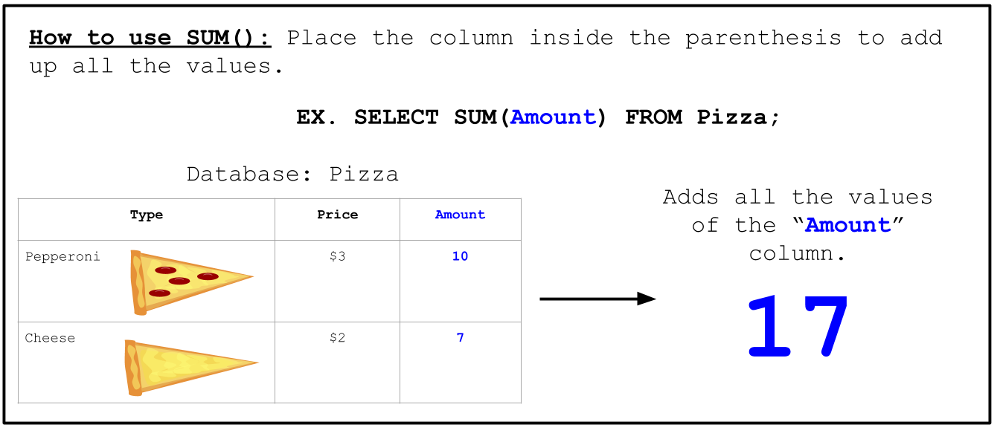

<!-- Links for javascript and CSS needed for drop down logic -->
<link rel="stylesheet" href="../default/_default.css" type="text/css"></link>
<link rel="stylesheet" href="../default/_type.css" type="text/css"></link>

<link rel="stylesheet" href="_activity10.css" type="text/css"></link>



## Return the Legendary Totems of Fun to The Leader

You have successfully found both Legendary Totems of Fun! The Leader thanks you for finding their lost treasure.

### The Leader also reveals a secret:
{}
The Legendary Totems of Fun cannot unleash their full potential until they are merged together. They can only be merged together by the "Inventor".

Your next step is to find the person who can combine both Legendary Totems of Fun. The "Inventor" will only appear if you throw a huge party!
{}

## Task 10: Help the inhabitants set up for the party!
The whole planet is invited! Help the citizens prepare for the party by finding out how many guests will be attending!

Let's go over the `SUM` Command!

#### Using the database 'planet' and the `SUM()` command, find the total number of guests that will attend this amazing party!

{}
Use the command from activity 1 to display the entire database.

* Hint 1: The command follows very closely to the example and the `AVG()` example (previous task).
* Hint 2: The 'population' column holds information on the number of individuals per city.
{}

<!-- SQL Type In Activity -->



    

      <h3 id = "commands" contenteditable="true" onclick="placeholder()">Type command here!</h3>
    

    

      <h3 id = "prev"></h3>
    

    

    <button class="button button1" onclick="sql()"> Enter </button>
    

 
    <button class = "button reset" onclick="reset()">Reset</button>

 
  
<h1 class="error" id="sqlcommand" style="visibility:hidden"><strong>ERROR INVALID INPUT></strong></h1>
  
<table id="table">
  <tr></tr>
</table>
  
<h4 id="story"></h4>
  
<!-- Tells User to continue mission -->

  

    &#10003;
    You've completed the task! Continue to the next mission!
  


