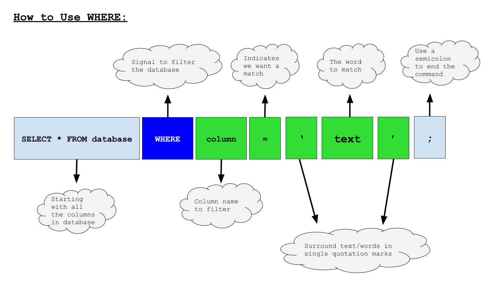
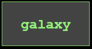
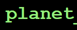
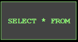

<!-- Links for javascript and CSS needed for drop down logic -->
<link rel="stylesheet" href="../default/_default.css" type="text/css"></link>
<link rel="stylesheet" href="../default/_type.css" type="text/css"></link>
<link rel="stylesheet" href="_activity2.css" type="text/css"></link>



## Task 2: Travel to the Planet of Fun!

You need to program your rocket ship GPS to go to the Planet of Fun by rearranging the code blocks. To find the coordinates,
the Galactic Federation has given you the next SQL command: `WHERE`!

{}
### What the command does:
The `WHERE` command allows you to only show data that you want.
{}

### Example:

{}
1. The `SELECT * FROM` database block that we learned from the previous activity allows us to choose a database to look through.

2. The `WHERE` command allows us to narrow down what data is displayed depending on the condition (the green blocks in the image below).

**A condition is a requirement you are looking for. Conditions do not have to follow the example above, but the most common use of conditions are looking for rows that contain specific information.**

3. The name of the column we wish to look for information in.
 
4. The equal sign means that we want to find information that matches what we have on the right-hand side of the equal sign. 

5. When we are looking for specific words or text, we must surround the text with single quote marks. SQL uses single quote marks to indicate that we are looking for a word in the database.

6. You can replace 'text' with any word you are looking for in the database.

7. Semicolons act as the end of a SQL command, like a period at the end of a sentence.
{}

#### Using the database called 'galaxy' that has a column labeled 'planet', find the coordinates for the Planet of Fun!

<!-- rearrange code blocks on terminal to get coordinate block -->



<!-- Rectangles to Receive blocks -->

 

 

 

 

 

 

  

  

  

  

  

  

  

  

<!-- Press Enter and if correct, unhide coordinate block -->
<button class="button button1" onclick="check()"> Enter </button>

<table id="planet" style="visibility:hidden">
  <tr>
  </tr>
  
</table>

<h3> Now that you know where the Planet of Fun is, we can find more information about it and ignore the other planets. Let's go to the Planet of Fun! </h3>

<!-- Tells User to continue mission -->

  

    &#10003;
    You've completed the task! Continue to the next mission!
  


