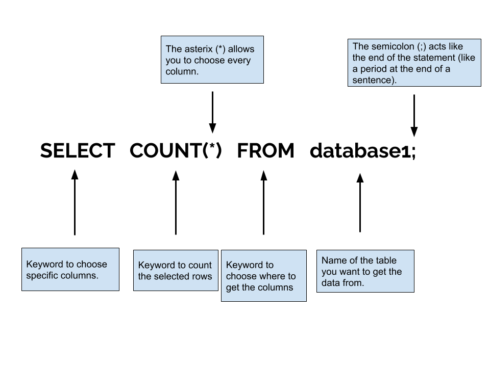
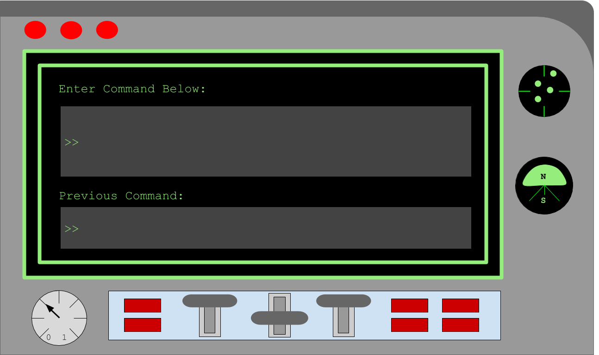

<!-- Links for javascript and CSS needed for drop down logic -->
<link rel="stylesheet" href="../default/_type.css" type="text/css"></link>
<link rel="stylesheet" href="../default/_default.css" type="text/css"></link>

After receiving the message from the Galactic Federation, you continue your adventure.

You have successfully arrived on the Planet of Fun! The Galactic Federation has sent you a database about this planet.

## Task 3: Talk to the inhabitants
You need to talk to the inhabitants of the Planet of Fun to discover what the problem is. Find out how many cities there are on the planet using the COUNT command!

When we use the SELECT * FROM planet; command, this table is displayed. But in order to check the number of cities, we can use the COUNT command.

#### Note: If you want to count the number of rows of a specific column, use the column name instead of the asterix.

### Question: Using COUNT, what command will display the number of cities on the Planet of Fun?
{}
* Hint 1: The Galactic Federation gave you the name of this database at the beginning of this activity
* Hint 2: You can use either the asterix (*) or a column name

{}



	

		
		

			<textarea id="commands" placeholder="Enter command here!" style="resize: none"></textarea>
      <button class = "button reset" onclick="document.getElementById('commands').value = ''">Reset</button>
			<button class="button button1" onclick="sql()" style="top:0vw; left:0vw">	Enter </button>
		

	

	      
	<h1 class="error" id="sqlcommand" <h1 class="error" id="sqlcommand" style="visibility:hidden"><strong>ERROR INVALID INPUT></strong></h1>

	<table id="table">
		<tr>
		</tr>
	</table>

	<h4 id="story"></h4>


