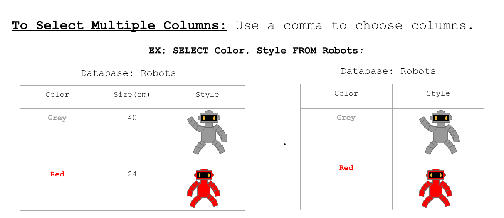

<!-- Links for javascript and CSS needed for drop down logic -->
<link rel="stylesheet" href="../default/_default.css" type="text/css"></link>
<link rel="stylesheet" href="../default/_type.css" type="text/css"></link>



## Task 4: Find Their Leader

After going to the Capital of Fun, you are told by the inhabitants to talk to their Leader. Find out which inhabitant is the Leader.
To do so, let's take a look at how to select multiple columns in a database.

#### Now use what you learned to find out who is the leader of the Planet of Fun!

{}
You can view the entire database using the `SELECT * FROM [database_name];` command that you learned in activity 1.

**The Galactic Federation also sends you a reminder that the 'galaxy' database holds the following columns:**

* planet_number: What order the planets show up in the database.

* planet: The name of the planet.

* leader: The name of the leader of the planet.

* population: How many inhabitants live on the planet.

* coordinate: The location of the planet in the galaxy.

**Hint: Only two columns are needed.**

{}

### Question: Using the 'galaxy' database, how do you display only the _names of the_ planets and their leader?

{}
Don't forget the semicolon at the end!
{}

<!-- SQL Type In Activity -->

  

    

      <h3 id = "commands" contenteditable="true" onclick="placeholder()">Type command here!</h3>
    

    

      <h3 id = "prev"></h3>
    

      

 
    <button class="button button1" onclick="sql()"> Enter </button>
    

 
    <button class = "button reset" onclick="reset()">Reset</button>
  

  

 
  <h1 class="error" id="sqlcommand" style="visibility:hidden"><strong>ERROR INVALID INPUT></strong></h1>
  <table id="table">
    <tr>
    </tr>
  </table>
  <h4 id="story"></h4>
  
  <!-- Tells User to continue mission -->
  

    
You found the correct command to display all the planets and their leaders!

    

      &#10003;
      You've completed the task! Continue to the next mission!
    

  

  

