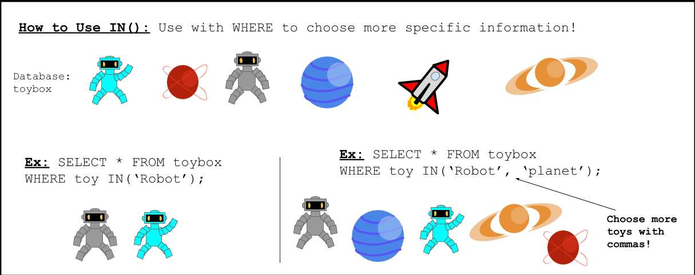
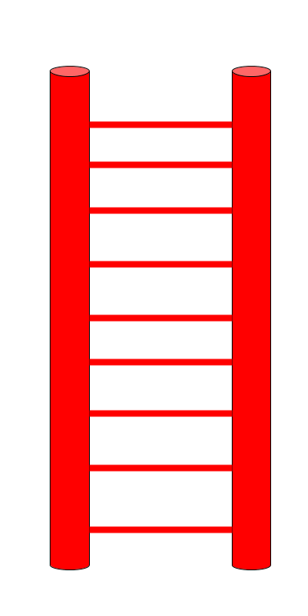
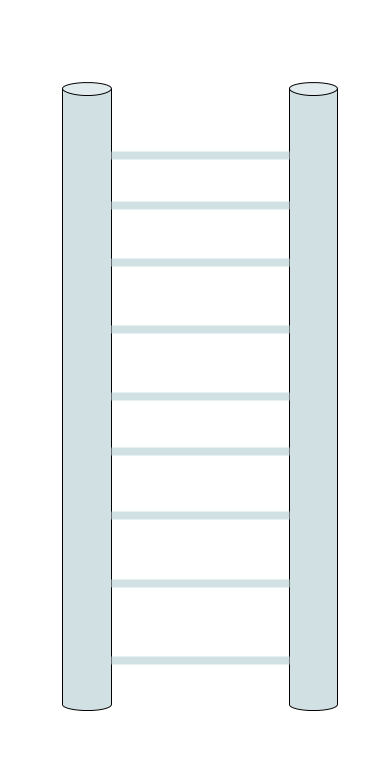
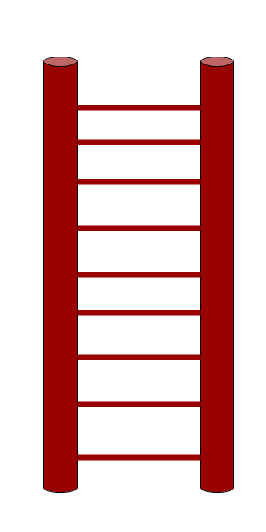

<!-- Links for javascript and CSS needed for drop down logic -->
<link rel="stylesheet" href="../default/_default.css" type="text/css"></link>
<link rel="stylesheet" href="../default/_type.css" type="text/css"></link>
<link rel="stylesheet" href="_activity5.css" type="text/css"></link>



## Task 5: Find the Tallest Ladder To Get To Their Leader

You have discovered that the planet's leader is in a hut on the tallest hill but to get to it, you need to find the largest ladder in the Capital of Fun!

The Galactic Federation has sent you four new SQL commands to play around with! Let's take a look at them!

### What the commands do:

 

{}
Column Property:
`MAX()` is used to look for the largest value in a column. `MIN()` is the opposite of `MAX()` and will look for the smallest value in a column.
You can replace any word inside the parenthesis with another column name to get the largest or smallest value of that column.
{}

{}
Notice how the items specified inside `IN()` and `NOT IN()` are surrounded by single quotation marks but the ones inside `MAX()` and `MIN()` are not.

 

Condition:
* `IN()` and `NOT IN()` are used hand in hand with the `WHERE` command we learned in activity 2. `IN()` is part of the condition of a SQL command and is helpful when you want to show some columns but not all of them.

* `NOT IN()` is the opposite of `IN()`. Instead of choosing what to show like `IN()`, `NOT IN()` will show all the columns you did not choose inside the parenthesis.

* You can use commas inside the parenthesis to choose more than one column to show or not show.

* Using only 1 input inside `IN()` is equivalent to using `=`: 

Ex. `column_name IN('obejct_in_column');` is the same as `column_name = 'obejct_in_column';`
{}

### Now use what you learned! Using the database called 'items' with columns labeled 'object' and 'height', find the tallest 'ladder'.
{}
You can display the database using the command from activity 1.

* Hint 1: Remember the advice from the Galactic Federation: `SELECT [column/column property] FROM [database] [optional condition];`

* Hint 2: Column property: Do you need to use `MAX()` or `MIN()` to find the tallest ladder?

* Hint 3: Condition: `WHERE [column_name] [IN/NOT IN];`

* Hint 4: Do you need to use `IN()` or `NOT IN()` to show the 'ladder'?

* Hint 5: What symbol do you need at the end of a SQL command?
{}

{}
* BONUS: Try to use multiple inputs inside `IN()` or `NOT IN()` when searching for the ladder
* This command is very powerful in searching multiple types of objects
{}
<!-- SQL Type In Activity -->



 

    

      <h3 id = "commands" contenteditable="true" onclick="placeholder()">Type command here!</h3>
    

    

      <h3 id = "prev"></h3>
    

      

 
    <button class="button button1" onclick="sql()"> Enter </button>
    

 
    <button class = "button reset" onclick="reset()">Reset</button>
  

  

 
  <h1 class="error" id="sqlcommand" style="visibility:hidden"><strong>ERROR INVALID INPUT></strong></h1>
  <table id="table">
    <tr></tr>
  </table>
  
  <h4 id="story"></h4>

  

      
    
 RED Ladder = 100 

    
 BLUE Ladder = 60 

    
 BROWN Ladder = 20 

     
  



### Choose and drag the correct ladder onto the hill to continue your adventure!

{}
The correct ladder will be highlighted in green.
{}



<!-- Player drags ladder block to drop block to finish mission -->

<!-- Drop Location -->

 

<!-- Drag Block -->

  

  

  

 

<!-- Next mission text displays -->

  
 You made it! The Leader tells you that the Planet of Fun is in danger of being invaded by the aliens from the Planet of Boredom!
  You must find the Totems of Fun in order to save the planet! 

<!-- Tells User to continue mission -->

  

    &#10003;
    You've completed the task! Continue to the next mission!
  


