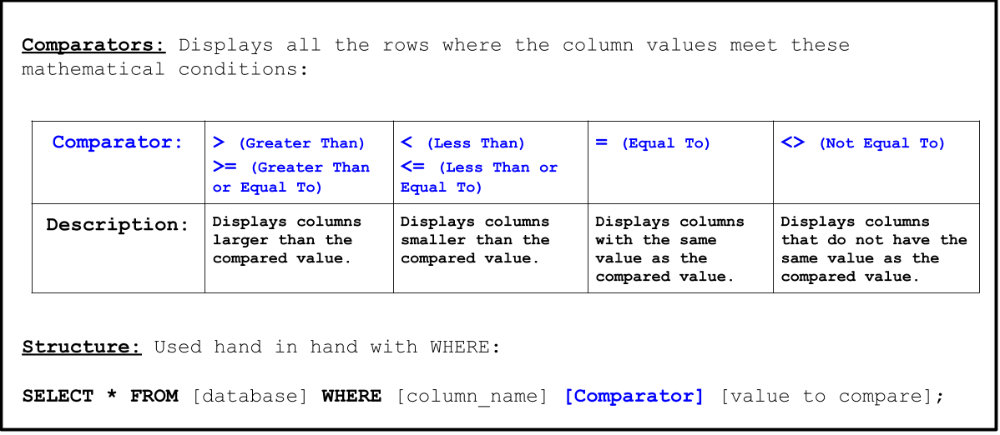
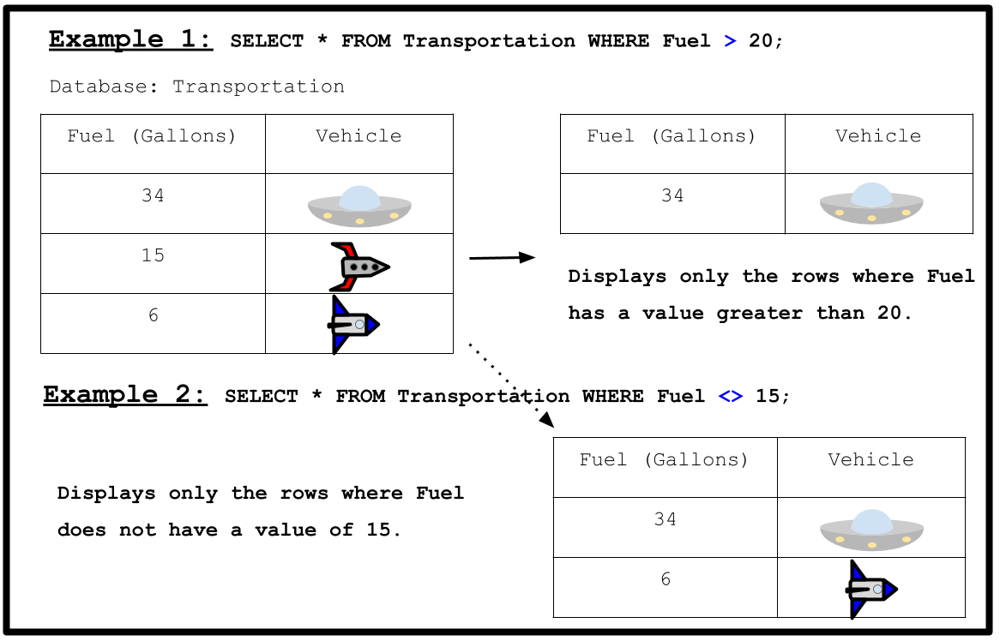

<!-- Links for javascript and CSS needed for drop down logic -->
<link rel="stylesheet" href="../default/_default.css" type="text/css"></link>
<link rel="stylesheet" href="../default/_type.css" type="text/css"></link>



## Task 6: Find the Legendary Totem of Fun: Confetti Cannon 

You need to explore the planet and find the first Legendary Totem of Fun - The Confetti Cannon of Fun. 
Legends say that this cannon will never stop shooting confetti and it is a symbol of never-ending peace and entertainment. 

{}
**Your only hint is that the artifact is created on 1738-09-12.**
{}
To help you out, the Galactic Federation has sent you a brief tutorial on how to compare numbers in the database.

{}
* In example 2, the `!=` symbols could be used instead of `<>` to give the same output.
* There are different versions of databases and the one you are using needs the value being compared to be inside single quotation marks! 
{}

### Using the database called 'items' with the column labeled 'date_created', find out which artifact is the Legendary Totem of Fun: Confetti Cannon

{}
You can display the database using the command from activity 1.

* Hint 1: The artifact is created on '1738-09-12' (Use single quotation marks around the date).
* Hint 2: What comparator do you need to use to find an exact match?
* Hint 3: The correct command follows closely to the example above.
* Hint 4: You do not need single quotation marks around the column or database names in this command.
* Hint 5: What symbol do you need at the end of a SQL command?

* BONUS: Display all items created on and after '1738-09-12' as well!
{}

<!-- SQL Type In Activity -->


  

    

      <h3 id = "commands" contenteditable="true" onclick="placeholder()">Type command here!</h3>
    

    

      <h3 id = "prev"></h3>
    

    

 
    <button class="button button1" onclick="sql()">Enter</button>
    

 
    <button class = "button reset" onclick="reset()">Reset</button>
  

  

 
  <h1 class="error" id="sqlcommand" style="visibility:hidden"><strong>ERROR INVALID INPUT></strong></h1>
  <table id="table">
    <tr></tr>
  </table>
  <h4 id="story"></h4>

  

    
 You found the location of the first Legendary Totem of Fun: The Confetti Cannon! 

  

  <!-- Unhide the Confetti Cannon -->
  
  
  <!-- Tells User to continue mission -->
  

    

      &#10003;
      You've completed the task! Continue to the next mission!
    

  


