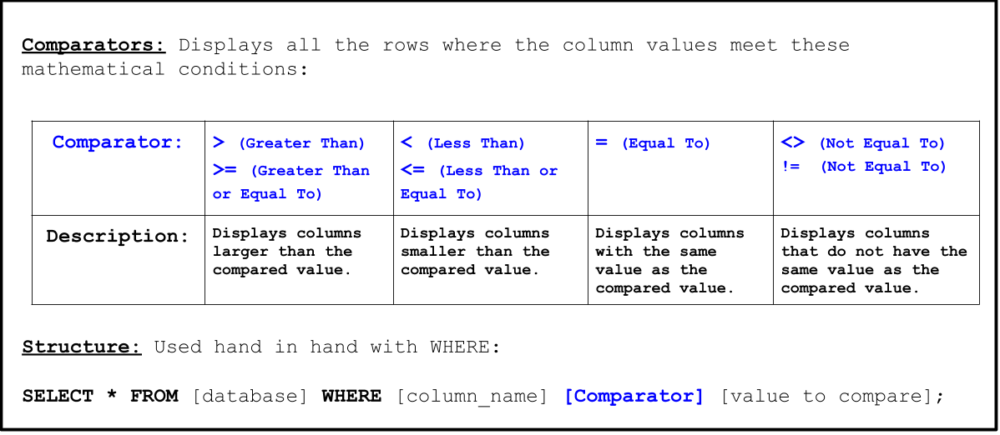

<!-- Links for javascript and CSS needed for drop down logic -->
<link rel="stylesheet" href="../default/_default.css" type="text/css"></link>
<link rel="stylesheet" href="../default/_type.css" type="text/css"></link>

<!-- Embed YouTube Video Link here when ready -->

## Task 6: Find the Legendary Totem of Fun: Confetti Cannon 

You need to explore the planet and find the first Legendary Totem of Fun - The Confetti Cannon of Fun. 
Legends say that this cannon will never stop shooting confetti and it is a symbol of never-ending peace and entertainment. 

{}
**Your only hint is that the artifact is created on 1738-09-12.**
{}
To help you out, the Galactic Federation has sent you a brief tutorial on how to compare numbers in the database.

{}
There are different versions of databases and the one you are using needs the value being compared to be inside single quotation marks! 
{}

### Using the database 'items' with the column 'date_created', find out which artifact is the Legendary Totem of Fun: Confetti Cannon

{}
Hint: The artifact is created on '1738-09-12' (Use single quotation marks).
{}

<!-- SQL Type In Activity -->


	

		

			<textarea id="commands" placeholder="Enter command here!" style="resize: none"></textarea>
		

      
      

 
      <button class="button button1" onclick="sql()">	Enter </button> 
      
      

 
      <button class = "button reset" onclick="document.getElementById('commands').value = ''">Reset</button>
         
	

	
	

 
	<h1 class="error" id="sqlcommand" <h1 class="error" id="sqlcommand" style="visibility:hidden"><strong>ERROR INVALID INPUT></strong></h1>
	
	<table id="table">
		<tr>
		</tr>
	</table>
	
	<h4 id="story"></h4>

	

		
 You found the location of the first Legendary Totem of Fun: The Confetti Cannon! 

	

	<!-- Unhide the Confetti Cannon -->
	


