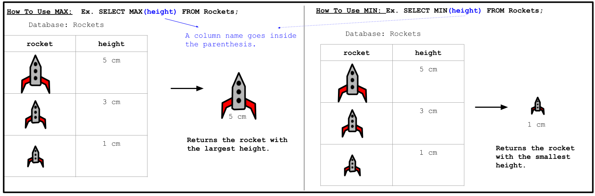

<!-- Links for javascript and CSS needed for drop down logic -->
<link rel="stylesheet" href="../default/_default.css" type="text/css"></link>
<link rel="stylesheet" href="../default/_type.css" type="text/css"></link>
<link rel="stylesheet" href="_activity7.css" type="text/css"></link>



## Task 7: Find the Key to Get to the Confetti Cannon!

You found the location of the Legendary Confetti Cannon but it is locked away behind a door made of titanium 
and can only be unlocked with the smallest key on the planet! 

**To help you out, the Galactic Federation has sent you a reminder on how to use `MIN()` from a previous activity.**

#### Using the database called <i>'items'</i> with columns labeled <i>'object'</i> and <i>'height'</i>, find the <i>'key'</i> with the smallest height.
{}
You can display the entire database using the command from activity 1.

* Hint 1: Remember the advice from the Galactic Federation: `SELECT [column/column property] FROM [database] [optional condition];`

* Hint 2: Condition: `WHERE [column_name] [IN()/NOT IN()];` 

* Hint 3: Do you need to use `IN()` or `NOT IN()` to show the 'key'?
{}
<!-- SQL Type In Activity -->



    

      <h3 id = "commands" contenteditable="true" onclick="placeholder()">Type command here!</h3>
    

    

      <h3 id = "prev"></h3>
    

    

 
    <button class="button button1" onclick="sql()"> Enter </button>
    

 
    <button class = "button reset" onclick="reset()">Reset</button>
  

  

 
  <h1 class="error" id="sqlcommand" style="visibility:hidden"><strong>ERROR INVALID INPUT></strong></h1>
  <table id="table">
    <tr></tr>
  </table>
  <h4 id="story"></h4>

<h4 id="story"></h4>

 


### Choose and drag the correct key onto the lock to continue your adventure!
{}
The height corresponds to the number of loops at the base of the key. The correct key will be highlighted in green.
{}



<!-- Player drags key block to drop block to finish mission -->

 

<!-- Position of first key -->

  

 

<!-- Drag Block -->

  

 

  

 

<!-- Drop Location -->

 

<!-- Next mission text displays -->

  <h3> You found the Legendary Totem of Fun: Confetti Cannon! </h3>

<!-- Unhide the Confetti Cannon -->

<!-- Tells User to continue mission -->

  

    &#10003;
    You've completed the task! Continue to the next mission!
  


