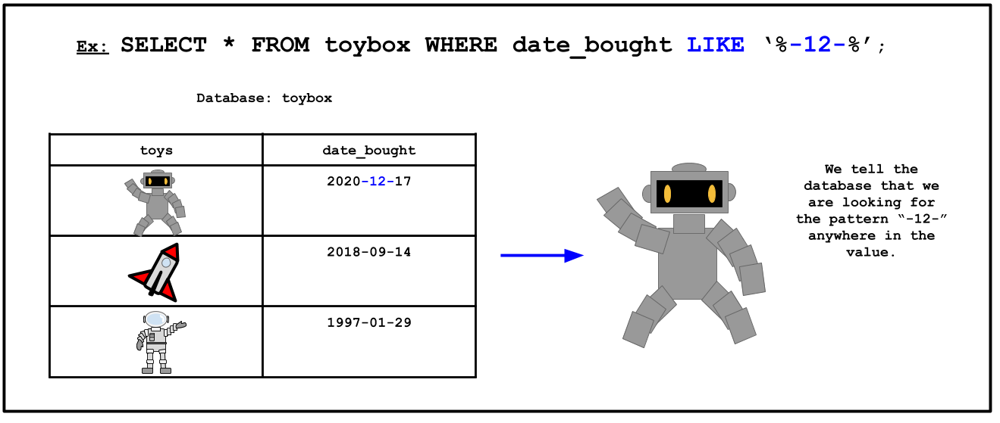

<!-- Links for javascript and CSS needed for drop down logic -->
<link rel="stylesheet" href="../default/_default.css" type="text/css"></link>
<link rel="stylesheet" href="../default/_type.css" type="text/css"></link>

<link rel="stylesheet" href="_activity8.css" type="text/css"></link>

<!-- Embed YouTube Video Link here when ready -->

## Task 8: Find the Legendary Totem of Fun: Infinite Buffet Table

Another artifact you must find is the infinite buffet table of fun! Legends say that festivals will never run 
out of food with this mystic buffet table. This Totem was created a month after the previous artifact: 
the Confetti Cannon (reminder: the Confetti Cannon was created on 1738-09-12).

**The Galactic Federation has sent you a brief tutorial on a handy command: LIKE**

#### Using the database called 'items' with a column labeled 'date_created', find the Infinite Buffet Table!
{}
* Hint 1: The format for the date is Year-Month-Day.
* Hint 2: This Totem was created a month AFTER the Confetti Cannon (1738-09-12).
* Hint 3: What is the pattern? Do you need to look for the month at the beginning, end, or anywhere of the value?
{}
<!-- SQL Type In Activity -->



  

    <textarea id="commands" placeholder="Enter command here!" style="resize: none"></textarea>
    <button class = "button reset" onclick="document.getElementById('commands').value = ''">Reset</button>
    <button class="button button1" onclick="sql()"> Enter </button>
  

      
<h1 class="error" id="sqlcommand" <h1 class="error" id="sqlcommand" style="visibility:hidden"><strong>ERROR INVALID INPUT></strong></h1>

<table id="table">
	 <tr>
	 </tr>
</table>

<h4 id="story"></h4>

  
 You found the location of the Legendary Totem of Fun: Infinite Buffet Table! Now we will travel to Fun Capital!

 

<!-- Unhide the Confetti Cannon -->

