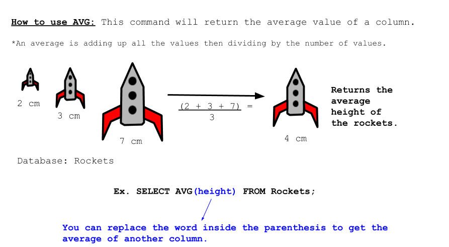

<!-- Links for javascript and CSS needed for drop down logic -->
<link rel="stylesheet" href="../default/_default.css" type="text/css"></link>
<link rel="stylesheet" href="../default/_type.css" type="text/css"></link>

<link rel="stylesheet" href="_activity9.css" type="text/css"></link>

<iframe width="560" height="315" src="https://www.youtube.com/embed/XLm2T6XBltg" title="YouTube video player" frameborder="0" allow="accelerometer; autoplay; clipboard-write; encrypted-media; gyroscope; picture-in-picture" allowfullscreen></iframe>

## Task 9: Unlock the Infinite Buffet Table:

You discovered the location of the Legendary Infinite Buffet Table! However, it is locked behind a door that 
will only unlock if you find the secret number. 

{}
Your only clue is that the combination is the first two digits of the average city population.
{}

**Let's look at the `AVG()` command!**

#### Using the database 'planet' and the `AVG()` command, find the first two digits of the average city 'population'!
{}
Use the command from activity 1 to view the entire database.

* Hint 1: The command follows very closely to the example.

* Hint 2: How do you use 'population' with the `AVG()` command?
{}
<!-- SQL Type In Activity -->


  

    

      

        <h3 id = "commands" contenteditable="true" onclick="placeholder()">Type command here!</h3>
      

      

        <h3 id = "prev"></h3>
      

      

 
      <button class="button button1" onclick="sql()"> Enter </button>
      

 
      <button class = "button reset" onclick="reset()">Reset</button>
    
 <!-- terminal_div -->
  
 <!-- content_scaler -->
  

 
  <h1 class="error" id="sqlcommand" style="visibility:hidden"><strong>ERROR INVALID INPUT></strong></h1>
  <table id="table">
    <tr></tr>
  </table>
  <h4 id="story"></h4>



### Figure out the combination to unlock the vault!
{}
The clue to the combination is at the top of this page!
{}



  

    

    <button class="button first_up" id = "first_up" onclick="add(1)"> + </button>
    <button class="button sec_up" id = "sec_up" onclick="add(2)"> + </button> 
    
    

 
    
    <textarea class="lock" id="lock1" readonly>0</textarea>
    <textarea class="lock" id="lock2" readonly>0</textarea>
    
    <button class="button first_down" id = "first_down" onclick="subtract(-1)" style="clear:left;"> - </button>
    <button class="button sec_down" id = "sec_down" onclick="subtract(-2)"> - </button>
    

    

    <button class="button vault_button" id = "vault_button" onclick="confirm()"> Check </button>
    

    
    

 

  
 <!-- vault_div -->

 <!-- content_scaler -->

 

<h5 id="plot" style="visibility:hidden"> You did it, Space Explorer! You found the Legendary Totem of Fun: Infinite Buffet Table! </h5> 

<!-- Unhide the Infinite Buffet Table -->

<!-- Tells User to continue mission -->

  

    &#10003;
    You've completed the task! Continue to the next mission!
  


