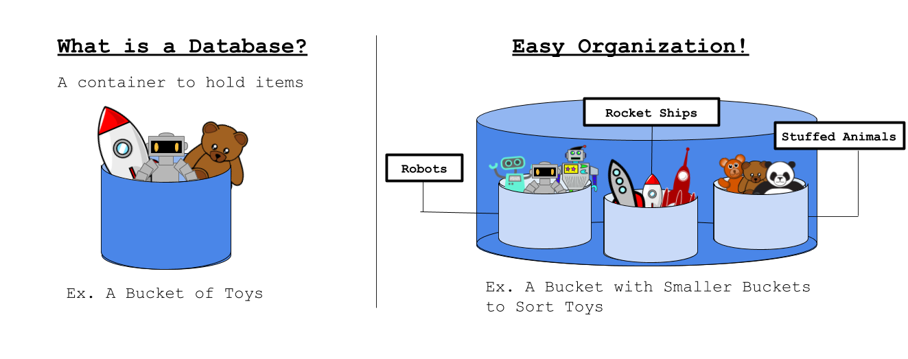
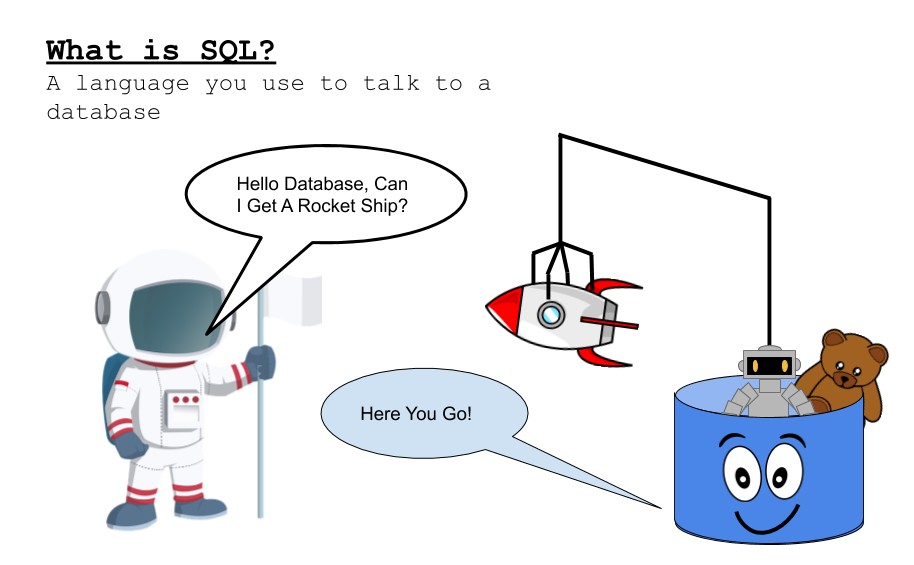
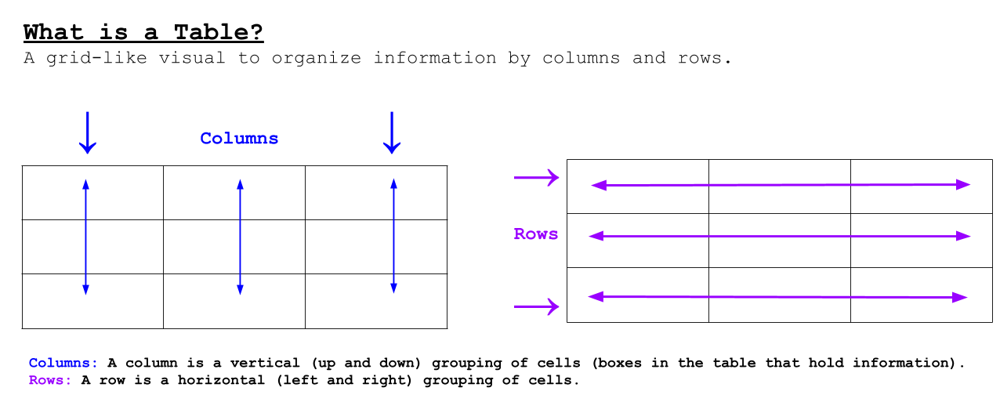

<iframe width="560" height="315" src="https://www.youtube.com/embed/l5BDCMyFHVI" title="YouTube video player" frameborder="0" allow="accelerometer; autoplay; clipboard-write; encrypted-media; gyroscope; picture-in-picture" allowfullscreen></iframe>

# Cadet Training!
As a new honorary space explorer, let's go over some basics!

## What Is A Database?

 It is a type of container for you to hold and organize information. 
Think of a database like a bucket where you can place toys in so they don’t get lost 
and you can easily find them later. This bucket might hold smaller buckets to sort 
your toys.

## What is SQL?

SQL stands for “Structured Query Language” and like its name, 
it is a language that lets you talk to the database to get the information 
you need. A SQL command is like a sentence you say to the database.

## What is a Table?

A table can be a database.

Now that you have some knowledge of what databases and SQL commands are, you will be
 learning how to use these on your missions! Continue to start your first official 
 space adventure!
