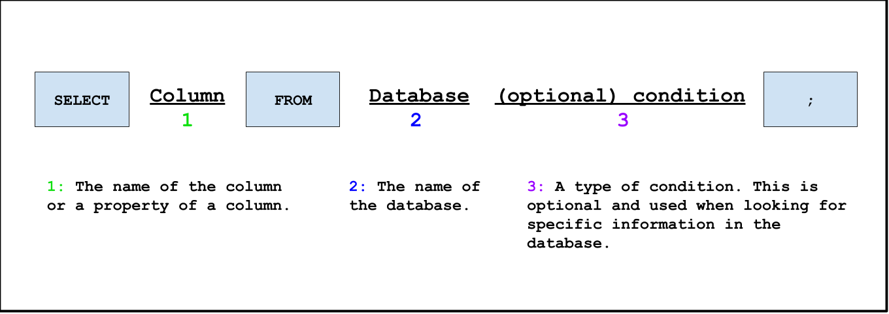



# An email from the Galactic Federation?
In the middle of your journey, you suddenly receive a message from the Galactic Federation. What could it be about?

 

Sender: The Galactic Federation

Receiver: Space Cadet

Subject: Upgraded Terminal

 

Dear Space Cadet,

 

Our records have indicated that you have learned enough commands to learn the basic structure for SQL commands.
**The Galactic Federation has taken notice of your achievements and has decided to bestow upon you an upgraded terminal!**
During your journey, you will need your handy-dandy terminal to display information about the planet around. Now you are able to type in commands!

 

As per the Space Explorer Guidelines, we will now debrief you on the core structure of a SQL 
command in hopes that you will be able to overcome the challenges that have yet to come.

<!--{}
* Column and database names are **case sensitive**, this means that if the names are all lower-case, please make sure they are lower-case when you type them!
* Please don't forget the semicolon at the end of a SQL command!
{}-->

Hopefully our advice will help you in your journey. Good Luck, Space Cadet!

 

Wishing You The Best Adventure,

 

The Galactic Federation