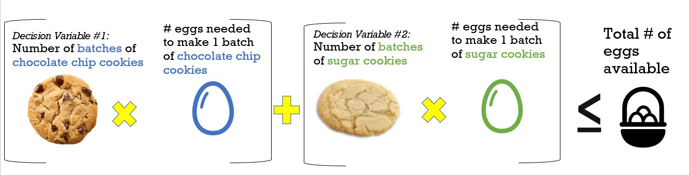

{}

## What is optimization?
Official definition: A mathematical optimization model consists of an objective function and a set of constraints in the form of a system of equations or inequalities.

{}

Linear optimization may sound really complicated- and it can be. But to start off, you only really need to understand a few things.

## Optimization

Optimization is how you make the most efficient decision when you have limited resources. For example, when you only have a limited amount of time you’re allowed to play on your Xbox, you want to make sure you’re playing your favorite game for the majority of that time so you’re using your time efficiently.

In an optimization problem, you are writing a math formula to represent real world constraints, like computer time, or number of eggs. (I guess we do use algebra after all)! 

Nowadays, you can use Excel (or Python) to solve these problems without actually writing the equations yourself. 

There are 3 main parts you need to learn: decision variables, objective function, and constraints.

## Decision Variables 

Decision Variables: These are the variables you want to optimize (such as # of eggs). The computer will solve this for you and recommend the optimal quantity. 
 

## Objective Function

Objective Function: This is the equation that describes what your goal is. For example, you may want to maximize the amount of money you make in your bakery. How do you calculate the amount of money you will make? It’s the profit of each cookie multiplied by the number of cookies you will make (this is where the decision variables come into play!)
 

## Constraints 

Constraints: These are the limitations you have. For example, if you have a limited number of eggs, you want to make sure the total eggs you use is less than the number of eggs you have in stock. That is how you form your equation. 

 