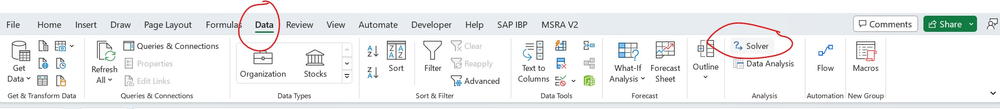

To run an optimization problem in Excel, you need to enable the add-on called “Solver.” Follow the link below for details or see the image below. 

Link for more help:
https://support.microsoft.com/en-us/office/load-the-solver-add-in-in-excel-612926fc-d53b-46b4-872c-e24772f078ca

You can find your solver add-in by clicking on “data” and then “solver” in the header. 

Next, please download the following template.

[Template](Cookie%20Bakery%20Optimization%20Template.xlsx)

Follow along in the template to help set up your problem. When using “Solver” you just need to select the cell number and the appropriate relationship between the cells. Your instructor can help you with this if you’re unfamiliar with Excel. 

You can use the “answers” Excel to check your answers. There is also a screenshot of the correct way to set up your Solver.

[Answers](Cookie%20Bakery%20Optimization%20Answers.xlsx)

Good luck!