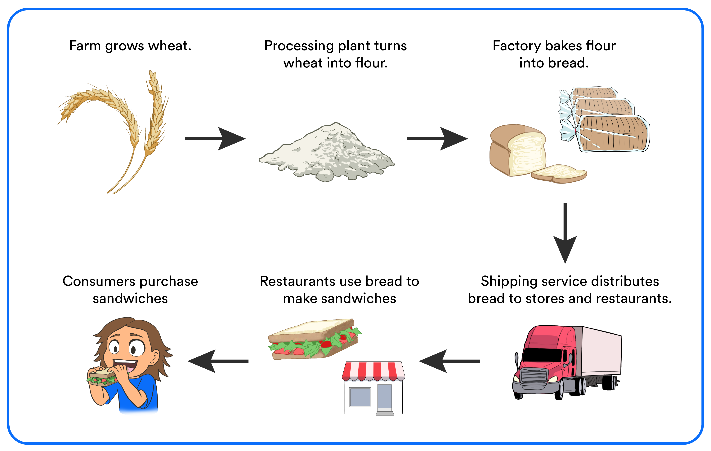

First thing's first... what is a supply chain? 

{}
## What is a Supply Chain?

“A supply chain moves a product or service from supplier to customer. It is the people, activities, information, and resources which move the product.” 

{}

Example: Your parents pack you a yummy sandwich to take to school for lunch the next day. Here’s what it takes to make that happen:
1.	Farm grows the wheat
2.	A facility turns that wheat into flour
3.	A factory bakes that flour into bread
4.	A delivery truck will take that bread from the factory and deliver it to the sandwich shop.
5.	A chef makes the sandwich for you using that bread
6.	You as the customer goes and buys that bread!

This might sound simple. After all, when you’re craving cookies, all you have to do as the customer is go to the grocery store and pick up the cookies from the shelf. You might not think of all the things that go on behind the scene - and there’s a lot of them. Here’s some examples of roles: 

Nowadays, technology plays a super big part in how supply chains work. Today, I’m going to show you how you can use technology and math to help run your supply chain!

## Table of Contents

Table of Contents

{}

