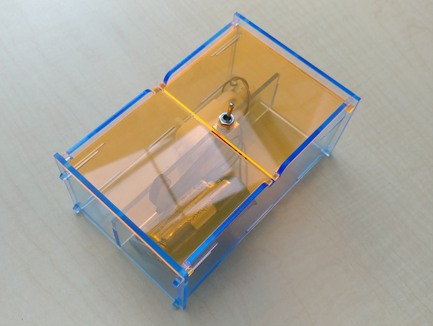

# Can we make a box for Nuvi?

Nuvi is in a bad mood and wants to be left alone. You have to build it a house and let it know you're there by pressing the switch. Nuvi doesn't really want to talk right now, so it will let you know that by pushing the switch back.
Let’s make what’s called a “useless box”. This could also be amusement for little ones, or just a silly gadget that’s fun to play with and pass the time 😊.

This is what it would look like:

When the switch on the top of the box is flipped “ON”, a “finger” comes out of the box, turns the switch “OFF”, and then retracts into the box. 

The goal is to learn the basics of circuits while having fun making the box open and close.

Table of Contents

{}

