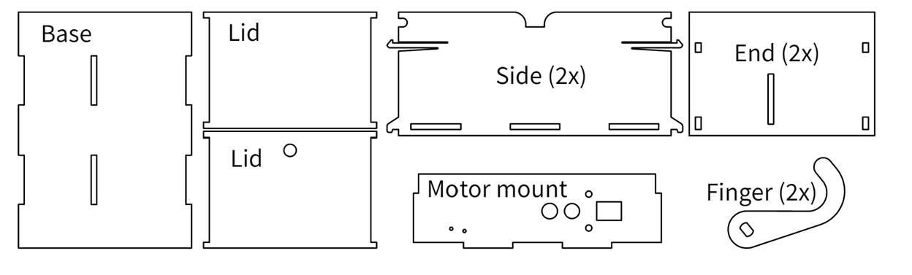

## Let’s build the box

1.	Glue 2 fingers together, to make a thicker finger. (If it’s already thick enough, skip this step)
2.	Attach the motor to the motor mount
3.	Attach the momentary/limit switch 
4.	Mount the toggle switch onto the lid
5.	Press the finger onto the motor shaft and secure it
6.	The rest of the box slides and snaps together.
	a.	Fit the motor mount piece to the base, try to get the finger to be centered in the box
	b.	Fit the sides
	c.	Put one lid on and snap the end. 
Should look something like this:

Here’s the circuit design:

When the limit switch connects and something (for example: you) changes the position of the toggle switch ON, the battery powers the motor, which moves the finger.  
The mechanical finger from inside the box comes out and toggles the switch OFF, so the mechanical finger retracts.

### *CONGRATS! You’ve done it. Feel free to play with your box and learn or experiment with more basic circuits.*

Supporting resources: 

1. http://makezine.com/projects/the-most-useless-machine/
2. http://www.youtube.com/watch?v=aqAUmgE3WyM

---

 ## You did it!

 ## Workshop completed!